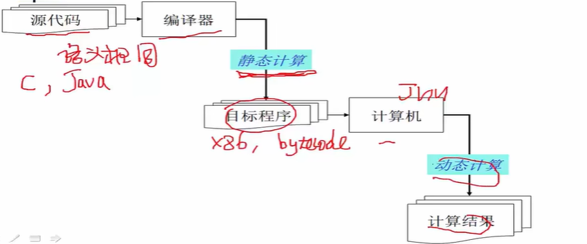

## Concepts of Compilers

### What is compilers?

a program that can translate from source programs to target program.

### the key function of Compilers.

Source program will be translated to target program by the compiler.This procedure is called **Static Computation**.

Then, target program(bytecode in java) will be computed dynamically by the computer(maybe virtual machine).Finally we get the result.
