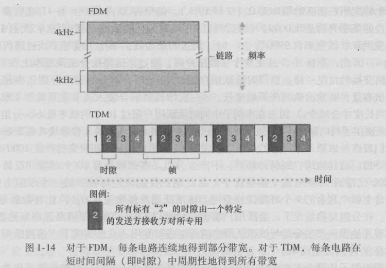
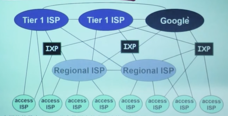
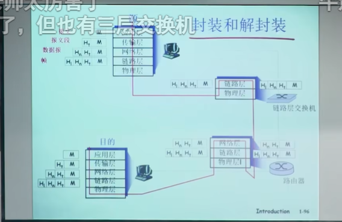

#### 网络协议

一个协议定义了在两个胡多个通信实体之间交换的报文格式和次序，以及报文发送和/或接收一条报文或其他时间所采取的动作。

#### 网络边缘

1. 端系统(end-systems)/主机(host)：运行应用程序，如web、email、在网络的边缘
2. 客户/服务器模式(client/server mode):客户端向服务器请求、接受服务，如Web浏览器/服务器、email客户端/服务器
3. 对等模式(peer-peer mode):很少(甚至没有)专门的服务器，如Gnutella、koZaA\Emule

**采用网络设施的面向连接服务**

目标：在端系统之间传输数据

握手：在数据传输之前做好准备(为连接建立状态)

TCP-传输控制协议(Transmission Control Protocol):Internet上面向连接的服务。

TCP服务：
1. 可靠地、按顺序地传送数据(确认和重传)
2. 流量控制(发送方不会淹没接收方)
3. 拥塞控制(当网络拥塞时，发送方降低发送速率)

应用:HTTP(Web)、FTP(文件传送)、Telnet(远程登陆)、SMTP(email)

**采取基础设施的无连接服务**

目标：在端系统之间传输数据(无连接服务)

UDP-用户数据报协议(User Datagram Protocol)
1. 无连接
2. 不可靠数据传输
3. 无流量控制
4. 无拥塞控制
   
应用:流媒体、远程会议、DNS、Internet电话

#### 网络核心

网络核心:路由器的网状网络

基本问题:数据怎样通过网络进行传输?

1. 电路交换:为每个呼叫预留一条专用电路1，如电话网
2. 分组交换:
    1. 将要传送的数据分成一个个单位，分组
    2. 将分组从一个路由器传到相邻路由器(hop)，一段段最终从源端传到目标端
    3. 每段:采用链路的最大传输能力(带宽)

**电路交换**

端到端的资源被分配给从源端到目标端的呼叫“call”;

独享资源，每个呼叫一旦建立起来就能够保证性能，如果呼叫没有数据发送，被分配的资源就会被浪费。通常被传统电话网络采用。

为呼叫预留端-端资源
1. 链路带宽，交换能力
2. 专用资源不共享
3. 保证性能
4. 要求建立呼叫连接

1. 频分复用(Frequency-Division Multiplexing,FDM):在连接期间链路为每条连接专用一个频段。频段宽度称为带宽(bandwidth)
2. 时分复用(Time-Division Multiplexing,TDM):时间被分为固定区间的帧，每帧被划分为固定数量的时隙。每条连接在每帧中有一个指定的时隙，专门由该连接单独使用。

图1-14 对于FDM，每条电路连续地得到部分带宽。对于TDM，每条电路在短时间间隔(即时隙)中周期地得到所有带宽。

电路交换不适合计算机之间的通信
1. 连接建立时间长
2. 计算机之间的通信有突发性，如果使用线路交换，则浪费的片较多(即使这个呼叫没有数据传递，其所占据的片也不能够被别的呼叫使用)
3. 可靠性不高

**分组交换**

1. 以分组为单位存储-转发方式：
   1. 网络带宽资源不再分为一个个片，传输时使用全部带宽。
   2. 主机之间传输的数据被分为一个个分组

2. 资源共享，按需使用：存储-转发：分组每次移动一跳(hop) 
   1. 在转发之前，节点必须收到每个分组
   2. 延迟比线路交换要大
   3. 排队时间

排队延迟和丢失
排队和延迟：
如果到达速率>链路的输出速率：
1. 分组将会排队，等待传输
2. 如果路由器的缓存用完了，分组将会被抛弃

分组交换：统计多路复用
还是划分时间片的形式(时分复用链路资源)，但是分组没有固定的模式(波分、频分、时分、码分)，统计多路复用是特殊的时分复用。

**分组交换网络：存储-转发**

分组交换：分组的存储转发一段一段从源端传到目标端，按照有无网络层的连接，分成：
1. 数据报网络：
   1. 分组的目标地址决定下一跳
   2. 在不同的阶段，路由可以改变
   3. 类似：问路
   4. Internet
2. 虚电路网络：
   1. 每个分组都带有标签，虚电路标识VC-ID标签决定下一跳
   2. 在呼叫建立时决定路径，在整个呼叫中路径保持不变
   3. 路由器维持每个呼叫的状态信息
   4. X.25和ATM

数据报(datagram)的工作原理：
1. 在通信之前，无需建立起一个连接，有数据就传输
2. 每一个分组都独立路由(路径不一样，可能会失序)
3. 路由器根据分组的目标地址进行路由

虚电路(virtual circuit)的工作原理：
靠信令的虚电路表，虚电路表定义了每个信令的输入输出，到下一个虚电路表继续查表。
就是不断地存储-转发。

**分组交换vs.电路交换**

分组交换：
分组交换允许更多用户使用网络。
1. 适合对突发式数据传输
   1. 资源共享
   2. 简单，不必建立呼叫
2. 过度使用会导致排队拥塞，分组延时和丢失
   1. 对可靠地数据传输需要协议来约束：拥塞控制

**网络核心的关键功能**

1. 路由：决定分组采用的源到目标的路径
2. 转发：将分组从路由器的输入链路转移到输出链路

**存储转发传输**

N条速率均为R的链路组成的路径(中间有N-1台路由器)
其端到端时延: d = N*L/R

#### 接入网与物理媒体

**接入网：digital subscriber line(DSL)**

采用现存的到交换局DSLAM的电话线
1. DSL线路上的数据被传到互联网
2. DSL线路上的语音被传到电话网

2.5Mbps上行传输速率(typically 1Mbps)
2Mbps下行传输速率(typically 10Mbps)

线缆网络：有线电视信号线缆双向改造
FDM：在不同频段传输不同信道的数据，数字电视和上网数据(上下行)

HFC:hybrid fiber coax
1. 非对称：最高30Mbps的下行传输速率，2Mbps上行传输速率
线缆和光纤网络将各家庭用户接入到ISP路由器
各用户共享到线缆头端的接入网络
1. 如DSL不同，DSL每个用户一个专用线路到CO(central office)

住宅接入：电缆模式
接入网：家庭网络
企业接入网络(Ethernet)

**无线接入网络**

各无线端系统共享无线接入网络(端系统到无线路由器)
1. 通过基站或者叫接入点

无线LANs:
1. 建筑物内部(100 ft)
2. 802.11b/g(WiFi):11.54Mbps传输速率
广域无线接入：
1. 由电信运营商(cellular)提供
2. 1到10Mbps
3. 3G,4G,LTE

**物理媒体**

Bit：在传输-接收对间传播
物理链路：在每个传输-接收对，跨越一种物理媒体
1. 导引型媒体：信号沿着固体媒介被导引：同轴电缆、光纤、双绞线
2. 非导引型媒体：信号自由传播：如无线电
双绞线(TP)
两根绝缘铜线
1. 5类：100Mbps Ethernet,Gbps以太网
2. 6类：10Gbps

同轴电缆、光纤
同轴电缆：
1. 两根同心的铜导线
2. 双向
3. 基带电缆：
   1. 电缆上一个单个信道
   2. Ethernet
4. 宽带电缆：
   1. 电缆上有多个信道
   2. HFC

光缆：
1. 光脉冲，每个脉冲表示一个bit，在玻璃纤维中传输
2. 高速：点到点的高速传输(如10Gps-100Gbps传输速率)
3. 低误码率：在两个中继器之间可以有很长的距离；不受电磁噪声的干扰
4. 安全

**物理媒介：无线电路**

1. 开放空间传输电磁波，携带要传输的数据
2. 无需物理"线缆"
3. 双向
4. 传播环境效应：反射、干扰、吸收
   
无线链路类型：
1. 地面微波
2. LAN
3. wide area
4. 卫星

#### Internet结构和ISP

网络结构1：单一的全球承载ISP互联所有接入ISP
网络结构2：多个全球承载ISP连接数十万个接入ISP
网络结构3：同区域的接入ISP->区域ISP(regional ISP)->第一层ISP(tier-1 ISP)
网络结构4：增加存在点(Point of Presence,PoP)、多宿、对等和因特网交换点(Internet exchange point,IXP)
网络结构5：在顶部增加内容提供商网络(content provider network)

在网络的最中心，一些为数不多的充分连接的大范围网络(分布广、节点有限、但是之间有着多重连接)
1. "tier-1" commercial ISPs(e.g. Level 3,Sprint,ATAT,NTT),国家或国际范围的覆盖
2. content provider network(e.g. Google)将他们的数据中心接入ISP，方便周边用户的访问；通常私有网络之间用专网绕过第一层ISP和区域ISPs

**Internet结构**
network of networks

中心：第一层ISP，国家/国际覆盖，速率极高
1. 直接与其他第一层ISP相连
2. 与大量的第二层ISP和其他客户网络相连
第二层ISP：更小些的(通常是区域性的)ISP
1. 与一个或多个第一层ISPs，也可能与其他第二层ISP
第三层ISP与其他本地ISP
1. 接入网(与端系统最近)

#### 分组丢失、延时和吞吐量

**分组丢失和延时是怎样发生的**

在路由器缓冲区的分组队列
1. 分组到达链路的速率超过了链路输出的能力
2. 分组等待排到队头、被传输

延时：正在传输的分组、分组排队
丢失：分组到达时，如果没有可用的缓冲区，则该分组被丢掉

**四种分组延时**

1. 节点处理延时(nodal processing delay)
   1. 检查bit级差错
   2. 检查分组首部和决定将分组导向何处
2. 排队延时(queuing delay)
   1. 在输出链路上等待传输的时间
   2. 依赖于路由器的拥塞程度
3. 传输延时(transmission delay)
   1. R=链路带宽(bps)
   2. L=分组长度(bits)
   3. 将分组发送到链路上的时间=L/R
   4. 存储转发延时
4. 传播延时(propagation delay)
   1. d=物理链路的长度
   2. s=在媒体上的传播速度(~2x10^8m/sec)
   3. 传播延时=d/s

节点延时d(nodal)=d(proc)+d(queue)+d(trans)+d(prop)
1. d(proc)=处理延时
   1. 通常是微妙数量级或更小
2. d(queue)=排队延时
   1. 取决于拥塞程度
3. d(trans)=传输延时
   1. =L/R,对于低速率的链路而言很大(如拨号)，通常为微秒级到毫秒级
4. d(prop)=传播延时
   1. 几微秒到几百毫秒

**排队延时**

R=链路带宽(bps)
L=分组长度(bits)
α=分组到达队列的平均速率

流量强度(traffic intensity)=Lα/R
1. ~0：平均排队延时很小
2. ->1:延时变得很大
3. >1:比特到达队列的速率超过了从该队列输出的速率，平均排队延时将趋于无穷大

**分组丢失**

原因
1. 链路的队列缓冲区容量有限
2. 当分组到达一个满的队列时，该分组将会丢失(lost)
3. 丢失的分组可能会被前一个节点或源端系统重传，或根本不重传

**吞吐量**

在源端和目标端之间传输的速率(数据量/单位时间)
1. 瞬间吞吐量：在一个时间点的速率
2. 平均吞吐量：在一个长时间内平均值
瓶颈链路：端到端路径上，限制端到端吞吐的链路(短板效应)
某文件由Fbits组成，主机B接收到所有Fbits用去T秒，则平均吞吐量为F/Tbps。

#### 协议层次和服务模型

**协议层次化**

本层的协议目的是为上层提供服务，本层服务靠下层的服务来实现

层次化方式实现复杂的网络功能：
1. 将网络复杂的功能分层功能明确的层次，每一层实现了其中一个或一组功能，功能中有其上层可以使用的功能：服务
2. 本层协议实体相互交互执行本层的协议动作，目的是实现本层功能，通过本层接口为上层提供更好的服务
3. 在实现本层协议的时候，直接利用了下层所提供的服务
4. 本层的服务：借助下层服务实现的本层协议实体之间交互带来的新功能(上层可以利用的)+更下层所提供的服务。

**服务和服务访问点**

服务(Service):低层实体向上层实体提供它们之间的通信的能力
1. 服务用户(service user)
2. 服务提供者(service provider)

原语(primitive):上层使用下层服务的形式，高层使用低层提供的服务，以及低层向高层提供服务都是通过服务访问原语来进行交互的形式

服务访问点SAP(Services Access Point)
使用下层提供的服务通过层间的接口-地点
1. 例子：邮箱
2. 地址(address):下层的一个实体支撑着上层的多个实体。SAP有标志不同上层实体的作用
3. 例子：传输层的SAP:端口(port)

**服务的类型**

面向连接的服务和无连接的服务-方式
1. 面向连接的服务(Connection-oriented Service)
   1. 连接(Connection)：两个通信实体为进行通信而建立的一种结合
   2. 面向连接的服务通信的过程：建立连接、通信、拆除连接
   3. 面向连接的服务的例子：网络层的连接被称为虚电路
   4. 特点：保序
   5. 服务类型：
      1. 可靠的信息流：传送界面
      2. 可靠的字节流：远程登陆
      3. 不可靠的连接：数字化声音
2. 无连接的服务(Connectionless Service)
   1. 无连接服务：两个对等层实体在通信前不需要建立一个连接，不预留资源：不需要通信双方都是活跃
   2. 特点：不可靠、可能重复、可能失序
   3. IP分组：数据包
   4. 适用类型：适合传送零星数据
   5. 服务类型：
      1. 不可靠的数据报
      2. 有确认的数据报
      3. 请求回答 信息查询

**服务和协议**

服务与协议的区别：
1. 服务(Service):低层实体向上层实体提供它们之间的通信的能力，是通过原语(primitive)来操作的，是垂直方向
2. 协议(protocol):对等层实体(peer entity)之间在相互通信的过程中，需要遵循的规则的集合，是水平方向的

服务与协议的联系：
1. 本层协议的实现要靠下层提供的服务来实现
2. 本层实体通过协议为上层提供更高级的服务

**分层处理和实现复杂系统的好处**

1. 概念化：结构清晰，便于标示网络组件，以及描述其相互关系
   1. 分层参考模型
2. 结构化：模块化更易于维护和系统升级
   1. 改变某一层服务的实现不影响系统中的其他层次
      1. 对于其他层次而言是透明的

**Internet协议栈**

1. 应用层：网络应用
   1. 为人类用户或者其他应用进程提供网络应用服务
   2. FTP(提供两个端系统之间的文件传输)、SMTP(提供电子邮件报文的传输)、HTTP(提供Web文档的请求和传送)、DNS(域名系统)
   3. 位于应用层的信息分组称为报文(message)
2. 传输层：主机之间的数据传输
   1. 在网络层提供的端到端通信基础上，细分为进程到进程，将不可靠的通信变成可靠的通信
   2. TCP、UDP
   3. 传输层分组称为报文段(segment)
3. 网络层：为数据报从源到目的选择路由
   1. 主机主机之间的通信，端到端通信，不可靠
   2. IP，路由协议
   3. 以分组为单位传输
   4. 网络层分组称为数据报(datagram)
4. 链路层；相邻网络节点间的数据传输
   1. 2个相邻2点的通信，点到点通信，可靠或不可靠
   2. 点对点协议PPP，802.11(wifi),Ethernet
   3. 链路层分组称为帧(frame)
5. 物理层：在线路上传送bit

**ISO/OSI参考模型**

位于应用层和传输层之间
1. 表示层：允许应用解释传输的数据，e.g.加密，压缩，机器相关的表示转换
2. 会话层：数据交换的同步，检查点，恢复

互联网协议栈没有这两层

每层封装，到链路器和路由器在两层或三层的解封装和再封装，源端和目标端进行大的封装和解封装。

**各层次的协议数据单元**

1. 应用层：报文(message)
2. 传输层：报文段(segment):TCP端，UDP数据报
3. 网络层：分组packet(如果无连接方式：数据报datagram)
4. 数据链路层：帧(frame)
5. 物理层：位(bit)
   
每一层分组具有两种类型的字段：首部字段和有效载荷字段(payload field)，有效载荷通常是来自上一层的分组。

#### 计算机网络和因特网的历史

Internet历史
1. 分组交换的发展(1961~1972)
2. 专用网络和网络互联(1972~1980)
3. 网络的激增(1980~1990):NCP协议正式被TCP/IP替代
4. 因特网爆炸(20世纪90年代)
5. 最新发展

#### 总结

**组成角度看什么是互联网**
1. 边缘：端系统(包括应用)+接入网
2. 核心：网络交换设备+通信链路
3. 协议：对等层实体通信过程中能够遵守的规则的集合

**为了实现复杂的网络功能，采用分层方式设计、实现和调试**
1. 应用层、传输层、网络层、数据链路层、物理层
2. 协议数据单位：报文(message)、报文段(segment)、分组(packet)、帧(frame)、位(bit)
   

**从服务角度看互联网**
1. 通信服务基础设施
   1. 提供的通信服务：面向连接、无连接
2. 应用

**应用之间的交互**
1. C/S模式
2. P2P模式

**数据交换**

数据交换
1. 分组数据交换
2. 线路交换

比较线路交换和分组交换

分组交换的2种方式
1. 虚电路
2. 数据报

接入网和物理媒介
1. 接入网技术
   1. 住宅：ADSL,拨号、coble modem
   2. 单位：以太网
   3. 无线接入方式
2. 物理媒介
   1. 光纤、网络电缆、以太网、双绞线

ISP技术

**分组交换网络中延迟和丢失是如何发生的**

延迟的组成：处理、传输、传播、排队

**网络的分层体系结构**

1. 分层体系结构
2. 服务
3. 协议数据单元
4. 封装与解封装

**历史**

#### 习题

**R1.主机”和“端系统”之间有什么不同？列举几种不同类型的端系统。Web服务器是一种端系统吗？**

主机是一个广义的术语，涵盖所有连接到网络的设备，包括那些参与路由和转发的中心设备，如路由器和交换机，而端系统专职网络边缘的设备，不包括中间的路由设备。端系统有：PC、智能手机、Web服务器是一种端系统。

**R9.拨号调制解调器、HFC、DSL和FTTH都用于住宅接入。对于这些技术中的每一种，给出传输速率的范围，并讨论有关带宽是共享的还是专用的。**

Modem:50kps
HFC:30Mbps下行;2Mbps上行
DSL:24Mbps下行;2.5Mbps上行
FTTH:20Mbps

**定在发送主机和接收主机间只有一台分组交换机。发送主机和交换机间以及交换机和接收主机间的传输速率分别是R，和R2。假设该交换机使用存储转发分组交换方式，发送一个长度为L的分组的端到端总时延是什么？（忽略排队时延、传播时延和处理时延。）**

t = L/R+L/R2

**R12.分组交换网络相比，电路交换网络有哪些优点？在电路交换网络中，TDM比FDM有哪些优点？**

电路交换的优点：
1. 为端到端预留了资源，保证了带宽
2. 延迟固定，低延迟，传输可靠和确定

TDM优点：
1. TDM将时间划分为不同时隙，不同用户在不同时间使用相同的频带，可以在不扩展频谱资源的情况下支持更多用户
2. 无频率间干扰
3. 容易实现同步
4. 带宽灵活分配

**R13.假定用户共享一条2Mbps链路。同时假定当每个用户传输时连续以1Mbps传输，但每个用户仅传输20%的时间。a当使用电路交换时，能够支持多少用户？b.作为该题的后继问题，假定使用分组交换。为什么如果两个或更少的用户同时传输的话，在链路前面基本上没有排队时延？为什么如果3个用户同时传输的话，将有排队时延？c.求出某指定用户正在传输的概率。d.假定现在有3个用户。求出在任何给定的时间，所有3个用户在同时传输的概率。求出队列增长的时间比率。**

a. 2
b. 在分组交换网络中，带宽是按需分配的，不同用户可以动态共享链路
c. 0.2
d. P(3个用户同时传输)=0.2×0.2×0.2=0.008

**R18.一个长度为1000字节的分组经距离为2500km的链路传播，传播速率为2.5×10^8m/s并且传输速率为2Mbps，它需要用多长时间？更为一般地，一个长度为L的分组经距离为d的链路传播，传播速率为s并且传输速率为Rbps，它需要用多长时间？该时延与传输速率相关吗？**

L=1000B
d=2500km
s=2.5x10^8m/s
R=2Mbps

传播时延跟速率无关，跟距离有关。

**R19.假定主机A要向主机B发送一个大文件。从主机A到主机B的路径上有3段链路，其速率R1=500kbps,R2=2Mbps,R3=1Mbps。a.假定该网络中没有其他流量，该文件传送的吞吐量是多少？b.假定该文件为4MB。用吞吐量除以文件长度，将该文件传输到主机B大致需要多长时间？c.重复（a）和（b），只是这时R2减小到100kbps。**

a. 500kbps
b. 64s
c. 320s

**R23.因特网协议栈中的5个层次有哪些？在这些层次中，每层的主要任务是什么？**

1. 应用层：为人类用户或其他应用进程提供网络应用服务。
2. 传输层：在网络层提供的端到端通信的基础上，细分为进程到进程，由不可靠的通信变成可靠的通信
3. 网络层：为数据报从源到目的选择路由，包括转发和路由
4. 链路层：负责相邻网络节点的数据传输
5. 物理层：在物理介质上加载和还原物理信号

**R25.路由器处理因特网协议栈中的哪些层次？链路层交换机处理的是哪些层次？主机处理的是哪些层次？**

网络层，链路层，物理层；链路层，物理层；五层都处理。

**P2.式（1-1）给出了经传输速率为R的N段链路发送长度L的一个分组的端到端时延。对于经过N段链路一个接一个地发送P个这样的分组，一般化地表示出这个公式。我们现在来考虑下列一般情况：通过由N条速率均为R的链路组成的路径（所以，在源和目的地之间有N-1台路由器），从源到目的地发送一个分组。应用如上相同的逻辑，我们看到端到端时延是：d端到端=NL/R  (1-1)**

t = NL/R+(P-1)L/R

**P3.考虑一个应用程序以稳定的速率传输数据（例如，发送方每k个时间单元产生一个N比特的数据单元，其中k较小且固定）。另外，当这个应用程序启动时，它将连续运行相当长的一段时间。回答下列问题，简要论证你的回答：a.是分组交换网还是电路交换网更为适合这种应用？为什么？b.假定使用了分组交换网，并且该网中的所有流量都来自如上所述的这种应用程序。此外，假定该应用程序数据传输速率的总和小于每条链路的各自容量。需要某种形式的拥塞控制吗？为什么？**

a. 电路交换，需要稳定的带宽；
b. 不需要，应用需要的带宽小于链路能提供的带宽，因此带宽能稳定提供。

**P6.这个习题开始探讨传播时延和传输时延，这是数据网络中的两个重要概念。考虑两台主机A和B由一条速率为Rbps的链路相连。假定这两台主机相隔m米，沿该链路的传播速率为sm/s。主机A向主机B发送长度L比特的分组。a.用m和s来表示传播时延dprop b.用L和R来确定该分组的传输时间dtransc.忽略处理和排队时延，得出端到端时延的表达式。d.假定主机A在时刻t=0开始传输该分组。在时刻t=dtrans，该分组的最后一个比特在什么地方？e.假定dprop大于dtrans。在时刻t=dtrans，该分组的第一个比特在何处？f.假定dprop小于dtrans。在时刻t=dtrans，该分组的第一个比特在何处？g.假定s=2.5×10^8，L=120比特，R=56kbps。求出使dprop等于dtrans的距离m。**

a. m/s
b. L/R
c. d端到端=dprop+dtrans=m/s+L/R
d. 刚离开主机A
e. 第一个比特还未到达主机B
f. 第一个比特在主机B
g. m/s=L/R,m=LS/R=536km

**P14.考虑某路由器缓存中的排队时延。令I表示流量强度；即I=La/R。假定排队时延的形式为IL/R(1-1)，其中1<1。a.写出总时延即排队时延加上传输时延的公式。b.以L/R为函数画出总时延的图。**

a. t=L/R+IL/R(1-I)
B. x = L/R,t = x/(1-αx)

**P22.考虑图1-19b。假定服务器与客户之间的每条链路的丢包概率为p，且这些链路的丢包率是独立的。一个（由服务器发送的）分组成功地被接收方收到的概率是多少？如果在从服务器到客户的路径上分组丢失了，则服务器将重传该分组。平均来说，为了使客户成功地接收该分组，服务器将要重传该分组多少次？**

(1-p)^n; 1/(1-p)^n-1 

**P25.假定两台主机A和B相隔20000km，由一条直接的R=2Mbps的链路相连。假定跨越该链路的传播速率是2.5×10^8m/s。a计算带宽-时延积R·tprop.考虑从主机A到主机B发送一个800000比特的文件。假定该文件作为一个大的报文连续发送。在任何给定的时间，在链路上具有的比特数量最大值是多少？c.给出带宽-时延积的一种解释。d.在该链路上一个比特的宽度（以米计）是多少？它比一个足球场更长吗？e.用传播速率s、带宽R和链路m的长度表示，推导出一个比特宽度的一般表示式。**

a. 1.6x10^5 bit
b. L = 8x10^5 bit ,最大值为1.6x10^5 bit
c. 链路上可以容纳多少个bit，无论时间还是空间
d. t = 1/R = 5X10^-7 m/s t x s = 125m
e. s/R

**P27.考虑习题P25，但此时链路的速率是R=1Gbps。a.计算带宽-时延积R·dop。b.考虑从主机A到主机B发送一个800000比特的文件。假定该文件作为一个大的报文连续发送。在任何给定的时间，在链路上具有的比特数量最大值是多少？c.在该链路上一个比特的宽度（以米计）是多少？**

a. 8x10^7 bit
b. 8x10^5 bit
c. 

**P31.在包括因特网的现代分组交换网中，源主机将长应用层报文（如一个图像或音乐文件）分段为较小的分组并向网络发送。接收方则将这些分组重新装配为初始报文。我们称这个过程为报文分段。图1-27显示了一个报文在报文不分段或报文分段情况下的端到端传输。考虑一个长度为8×10比特的报文，它在图1-27中从源发送到目的地。假定在该图中的每段链路是2Mbps。忽略传播、排队和处理时延。a.考虑从源到目的地发送该报文且没有报文分段。从源主机到第一台分组交换机移动报文需要多长时间？记住，每台交换机均使用存储转发分组交换，从源主机移动该报文到目的主机需要多长时间？b.现在假定该报文被分段为800个分组，每个分组10000比特长。从源主机移动第一个分组到第一台交换机需要多长时间？从第一台交换机发送第一个分组到第二台交换机，从源主机发送第二个分组到第一台交换机各需要多长时间？什么时候第二个分组能被第一台交换机全部收到？c.当进行报文分段时，从源主机向目的主机移动该文件需要多长时间？将该结果与（a）的答案进行比较并解释之。d.除了减小时延外，使用报文分段还有什么原因？e.讨论报文分段的缺点。**

