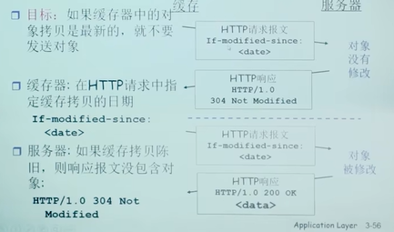

#### 应用层协议原理

**网络应用程序体系结构**

可能的应用架构：
客户-服务器模式(C/S:client/server)
对等模式(P2P:Peer To Peer)
混合体：客户-服务器和对等体系结构

客户-服务器(C/S)体系结构

服务器：
1. 一直运行
2. 固定的IP地址和周知的端口号(约定)
3. 扩展性：服务器场
   1. 数据中心进行扩展
   2. 扩展性差

客户端：
1. 主动与服务器通信
2. 与互联网有间歇性的连接
3. 可能是动态IP地址
4. 不直接与其他客户端通信

对等体(P2P)体系结构
1. 几乎没有一直运行的服务器
2. 任意端系统之间可以进行通信
3. 每一个节点既是客户端又是服务器
   1. 自扩展性-新的peer节点带来新的服务能力，当然也带来新的服务请求
4. 参与的主机间歇性连接且可以改变IP地址(难以管理)
5. 例子：Gnutella，迅雷

C/S和P2P体系结构的混合体
Napster
1. 文件搜索：集中
   1. 主机在中心服务器上注册其资源
   2. 主机向中心服务器查询资源位置
2. 文件传输：P2P
   1. 任意Peer之间

即时通信
1. 在线检测：集中
   1. 当用户上线时，向中心服务器注册其IP地址
   2. 用户与中心服务器联系，以找到其在线好友的位置
2. 两个用户之间聊天：P2P

**进程通信**

进程：在主机上运行的应用程序
1. 在同一主机内，使用进程间通信机制通信(操作系统定义)
2. 不同主机，通过交换报文(Message)来通信
   1. 使用OS提供的通信服务
   2. 按照应用协议交换报文(借助传输层提供的服务)

clients,servers
客户端进程：发起通信的进程
服务器进程：等待连接的进程

tips:P2P架构的应用也有客户端进程和服务器进程之分。

**对进程进行编址(addressing)**

进程为了接收报文，必须有一个标识
即：SAP(发送也需要标示)
1. 主机：唯一的32为IP地址
   1. 仅仅有IP地址是不能够唯一标示一个进程，在一台端系统上有很多应用进程在运行
2. 所采用的传输层协议：TCP or UDP
3. 端口号(Port Numbers)

一些知名端口号的例子：
1. HTTP:TCP 80 Mail: TCP 25 FTP: TCP 2 
2. 一个进程：用IP+Port标示端节点

本质上，一对主机进程之间的通信由2个端节点构成

**传输层提供的服务-需要穿过层间的信息**

层间接口必须要携带的信息：
1. 要传输的报文(对于本层来说：SDU)
2. 谁发的：对方的应用进程的标示：IP+TCP(UDP)接口
3. 发给谁：对方的应用进程标示：对方的IP+TCP(UDP)端口号

传输层实体(tcp或者udp实体)根据这些信息进行TCP报文段(UDP数据报)的封装
1. 源端口号：目标端口号，数据等
2. 将IP地址往下交IP实体，用于封装IP数据报，源IP，目标IP

**传输层提供的服务-层间信息的代表**

TCP socket：
1. TCP服务：两个进程之间的通信需要之前要建立连接
   1. 两个进程通信会持续一段时间，通信关系稳定
2. 可以用一个整数表示两个应用实体之间的通信关系，本地标示
3. 穿过层间接口的信息量最小
4. TCP socket：源IP,源端口，目标IP，目标IP,目标端口

不是端口号，是TCP在面向连接的服务当中本地IP，本地TCP端口和对方IP，对方TCP端口的本地标示

**TCP之上的套接字(socket)**

对于使用面向连接服务(TCP)的应用而言，套接字是4元组的一个具有本地意义的标示
1. 4元组：(源IP,源port，目标IP，目标port)
2. 唯一的指定了一个会话(2个进程之间的会话关系)
3. 应用使用这个标识，与远程的应用进程通信
4. 不必在每一个报文的发送都要指定这4元组
5. 就像使用操作系统打开一个文件，OS返回一个文件句柄一样，以后使用这个文件句柄，而不是使用这个文件的目录名，文件名
6. 简单，便于管理

**传输层提供的服务-层间信息代码**

UDP socket：
1. UDP服务，两个进程之间的通信需要之前无需建立连接
   1. 每个报文都是独立传输的
   2. 前后报文可能给不同的分布式进程
2. 因此，只能用一个整数来表示本应用实体的标示
   1. 因为这个报文可能传给另外一个分布式进程
   2. 穿过层间接口的信息大小最小
   3. UDP socket：本IP，本端口
3. 但是传输报文时:必须要提供对方IP，port
   1. 接收报文时，传输层需要上传对方的IP，port

**UDP之上的套接字(socket)**

对于使用无连接服务(UDP)的应用而言，套接字是2元组的一个具有本地意义的标示
1. 二元组：IP，port(源端指定)
2. UDP套接字指定了应用所在的一个端节点(end point)
3. 在发送数据报时，采用创建好的本地套接字(标示ID)，就不必要发送每个报文中指明自己所采用的ip和port
4. 但是在发送报文时，必须要指定对方的ip和udp port(另外一个端接点)

**套接字(socket)**

进程像套接字发送报文或从套接字接收报文
套接字<->门户
1. 发送进程将报文推出门户，发送进程依赖于传输层设施在另外一侧的门将报文交付给接收进程
2. 接收进程从另外一端的门户收到报文(依赖于传输层设施)

**如何使用传输层提供的服务，实现应用进程之间的报文交换，实现应用(用户使用服务)**

定义应用层协议：报文格式，解释，时序等
编制程序，通过API调用网络基础设施提供通信服务传报文，解析报文，实现应用时序等

**应用层协议**

1. 定义了：运行在不同端系统上的应用进程如何相互交换报文
   1. 交换的报文类型：请求和应答报文
   2. 各种报文类型的语法：报文中各个字段及其描述
   3. 字段的语义：即字段取值的含义
   4. 进程何时，如何发送报文及其对报文进行响应的规则
2. 应用协议仅仅是应用的一个组成部分
   1. Web应用：HTTP协议，web客户端，web服务器，HTML
3. 公开协议
   1. 由RFC文档定义
   2. 允许互操作
   3. 如HTTP，SMTP
4. 专用(私有)协议：
   1. 协议不公开
   2. 如：Skype

**应用需要传输层提供什么样的服务**

1. 数据丢失率
   1. 有些应用要求100%的可靠数据传输，有些可以容忍一定比例的数据丢失
2. 延迟
3. 吞吐
4. 安全性（机密性，可靠性，可认证性）
   

**Internet传输层提供的服务**

TCP服务：
1. 可靠的传输服务
2. 流量控制：发送方不会淹没接收方
3. 拥塞控制：当网络出现拥塞时，能抑制发送方
4. 不能提供的服务：时间保证，最小吞吐保证和安全
5. 面向连接：要求在客户端进程和服务端进程之间建立连接

UDP服务：
1. 不可靠数据传输
2. 不提供的服务：可靠，流量控制，拥塞控制，时间，带宽保证，建立连接
3. 适合用在对实时性要求比较高的应用

UDP存在的必要性
1. 能够区分不同的进程，而IP服务不能
   1. 在IP提供的主机到主机端到端功能的基础上，区分了主机的应用进程
2. 无需建立连接，省去了建立连接时间，适合事务性的应用
3. 不做可靠性的工作，例如检错重发，适合那些对实时性要求比较高而对正确性要求不高的应用
   1. 因为为了实现可靠性(准确性，保序等)，必须付出时间代价(检错重发)
4. 没有拥塞控制和流量控制，应用能够按照设定的速度发送数据
   1. 而在TCP上面的应用，应用发送数据的速度和主机向网络发送的实际速度是不一致的，因为由流量控制和拥塞控制

**安全TCP**

TCP&UDP
1. 都没有加密
2. 明文通过互联网传输，甚至密码

SSL(安全套接字层)
1. 在TCP上面实现，提供加密的TCP连接
2. 私密性
3. 数据完整性
4. 端到端的鉴别

SSL在应用层：应用采用SSL库，SSL库采用TCP通信

SSL socket API
1. 应用通过API将明文交给socket，SSL将其加密在互联网上传输

#### Web与HTTP

**HTTP概况**

1. Web的应用层协议：超文本传输协议(HyperText Transfer Protocol,HTTP)
2. HTTP由两个程序实现：客户程序和服务器程序
   1. 客户/服务器模式：
      1. 客户：请求，接收和显示Web对象的浏览器
      2. 服务器：对请求进行响应，发送对象的Web服务器
3. Web页面(Web Page)：由对象组成，一个对象(object)只是一个文件，如HTML,JPEG,Java，多数Web页面含有一个HTML基本文件(base HTML file)以及几个引用对象

HTTP概况(续)

1. 使用TCP:
   1. 客户发起一个与服务器的TCP连接(建立套接字)，端口号为80
   2. 服务器接收客户的TCP连接
   3. 在浏览器(HTTP客户端)与Web服务器(HTTP服务器server)交换HTTP报文(应用层协议报文)
   4. TCP连接关闭
2. HTTP是无状态(stateless)的：
   1. 服务器并不维护关于客户的任何信息，即不储存任何关于该客户的状态信息。无状态的服务器能够支持更多的客户端

分层体系结构最大的优点：HTTP协议不用担心数据丢失，也不关注TCP从网络的数据丢失和乱序故障中恢复的细节。那是TCP以及协议栈较低层协议的工作。

**非持续连接和持续连接(persistent/non-persistent connection)**

1. 非持久HTTP
   1. 最多只有一个对象在TCP连接上发送
   2. 下载多个对象需要多个TCP连接
   3. HTTP/1.0使用非持久连接
2. 持久HTTP
   1. 多个对象可以在一个(在客户端和服务器之间的)TCP连接上传输
   2. HTTP/1.1默认使用持久连接

响应时间模型
1. 往返时间RTT(round-trip time)：一个小的分组从客户端到服务器，再回到客户端的时间(传输时间忽略)
2. 响应时间：
   1. 一个RTT用来发起TCP连接
   2. 一个RTT用来HTTP请求并等待HTTP响应
   3. 文件传输时间
   4. 共：2RTT+传输时间

1. 非持久HTTP的缺点：
   1. 每个对象要2个RTT
   2. 操作系统必须为每个TCP连接分配资源
   3. 但浏览器通常打开并行TCP连接，以获取引用对象
2. 持久HTTP:
   1. 服务器在发送响应后，仍保持TCP连接
   2. 在相同客户端和服务器之间的后续请求和响应报文通过相同的连接进行传送
   3. 客户端在遇到一个引用对象的时候，就可以尽快发送该对象的请求
3. 非流水方式的持久HTTP:
   1. 客户端只能在收到前一个响应后才能发出新的请求
   2. 每个引用对象花费一个RTT
4. 流水方式的持久HTTP:
   1. HTTP/1.1的默认模式
   2. 客户端遇到一个引用对象就立即产生一个请求
   3. 所有引用(小)对象只花费一个RTT是可能的

**HTTP报文格式**

两个类型的HTTP报文：请求，响应
HTTP请求报文：
1. ASCII

HTTP请求报文

请求行(GET,POST,HEAD命令)：有三个字段：方法字段，URL字段，HTTP版本字段
首部行
换行回车符，表示报文结束
一个额外的换行回车符

HTTP请求报文通用格式

提交表单输入
1. Post方式：
   1. 网页通常包括表单输入
   2. 包含在实体主体(entity body)中的输入被提交到服务器
2. URL方式：
   1. 方法：GET
   2. 输入通过请求行的URL字段上载

方法类型
1. HTTP/1.0
   1. GET
   2. POST
   3. HEAD
      1. 要求服务器在响应报文中不包含请求对象->故障跟踪
2. HTTP/1.1
   1. GET,POST,HEADD
   2. PUT
      1. 将实体主体中的文件上载到URL字段规定的路径
   3. DELETE
      1. 删除URL字段规定的文件

HTTP响应报文

状态行(协议版本，状态码和相应状态信息)
首部行：connection，date，server，Last-Modified，Content-Length，Content-Type
数据，如请求的HTML文件

HTTP响应状态码
位于服务器->客户端的响应报文中的首行
一些例子：
1. 200 OK:
   1. 请求成功，请求对象包含在响应报文的后续部分
2. 301 Moved Permanently:
   1. 请求的对象已经被永久转移了；新的URL在响应报文的Location：在首部行中指定
   2. 客户端软件自动用新的URL去获取对象
3. 400 Bad Request
   1. 一个通用的差错代码，表示该请求不能被服务器解读
4. 404 Not Found
   1. 被请求的文档在该服务器上没有找到
5. 505 HTTP Version Not Supported
   1. 服务器不支持请求报文使用的HTTP协议版本

**用户与服务器的交互：cookie**

cookie技术的4个组件：
1. 在HTTP响应报文中的一个cookie首部行
2. 在HTTP请求报文中的一个cookie首部行
3. 在用户端系统中保留有一个cookie文件，并由用户的浏览器进行管理
4. 位于Web站点的一个后端数据库

Cookies能带来什么：
1. 用户验证
2. 购物车
3. 推荐
4. 用户状态(Web e-mail)

如何维持状态：
1. 协议端接点：在多个事务上，发送端和接收端维持状态
2. cookies：http报文携带状态信息

cookies允许站点知道许多关于用户的信息，包括用户在该网站上进行的所有操作。

**Web缓存**

Web缓存器(Web cache)/代理服务器(proxy server):能够代表初始Web服务器来满足HTTP请求的网络实体。Web缓存器有自己的磁盘存储空间，并在存储空间中保存最近请求过的对象的副本。

目标：不访问原始服务器，就满足客户的请求

1. 用户设置浏览器：通过缓存访问Web
2. 浏览器将所有的HTTP请求发给缓存
   1. 在缓存中的对象，缓存直接返回对象
   2. 如对象不在缓存，缓存请求原始服务器，然后再将对象返回给客户端

1. 缓存既是客户端又是服务器
2. 通常缓存是由ISP安装

为什么要使用Web缓存？
1. 降低客户端的请求响应时间
2. 可以大大减少一个机构的接入链路到Internet的通信量。减少带宽需求，降低了费用。
3. 互联网大量采用了缓存：降低了Internet上的Web流量，使得较弱的ICP也能够有效提供内容

**条件GET方法**

1. 目标：如果缓存器中的对象拷贝是最新的，就不要发送对象
2. 缓存器：在HTTP请求中指定缓存拷贝的日期
3. 服务器：如果缓存拷贝陈旧，则响应报文没包含对象

#### FTP

FTP:文件传输协议
1. 像远程主机上传输文件或从远程主机接收文件
2. 客户/服务器模式
   1. 客户端：发送传输的一方
   2. 服务器：远程主机
3. FTP:RFC 959
4. FTP服务器：端口号为21

HTTP和FTP都是文件传输协议，并且都运行在TCP上。

FTP相比于HTTP的区别：
1. 使用了两个并行的TCP连接来传输文件。
   1. 控制连接(control connection):用于在两主机之间传输控制信息，如用户标识、口令、改变远程目录的命令以及put和get文件的命令，FTP使用一个独立的控制连接，所以可以称FTP的控制信息是带外传送的(out-of-band)。
   2. 数据连接(data connection)：用于实际发送一个文件。

HTTP协议实在传输文件的同一个TCP连接中发送请求和响应首部行的。可以说是带内(in-band)发送控制信息的。

2. FTP客户端与FTP服务器通过端口21联系，并使用TCP为传输协议
3. 客户端通过控制连接获得身份确认
4. 客户端通过控制连接发送命令浏览远程目录
5. 收到一个文件传输命令时，服务器打开一个到客户端的数据连接
6. 一个文件传输完成后，服务器关闭连接

7. 服务器打开第二个TCP数据连接用来传输另外一个文件
8. FTP服务器维护用户的状态信息，当前路径，用户账户与控制连接对应,因此是有状态的(stateful)

FTP命令、响应

1. USER username: 用于向服务器传送用户标识
2. PASS password：用于向服务器发送用户口令
3. LIST:用于请求服务器回送当前远程目录中的所有文件列表。该文件列表是经一个(新建且非持续连接)数据连接传送的，而不是在控制TCP连接上传送。
4. RETR filename：用于从远程主机当前目录检索(即get)文件。该命令引起远程主机发起的一个数据连接，并经该数据连接发送所请求的文件。
5. STOR filename：用于在远程主机的当前目录上存放(即put)文件。

1. 331 Username OK,Password required
2. 125 Data connection already open;transfer starting
3. 425 Can't open data connection
4. 452 Error writing file

#### 因特网中的电子邮件

3个主要组成部分：
1. 用户代理(user agent)
2. 邮件服务器(mail server)：电子邮件体系结构的核心
3. 简单邮件传输协议(SMTP)：使用TCP可靠数据传输服务

用户代理
1. 又名“邮件阅读器”
2. 撰写，编辑和阅读邮件
3. 如Outlook，Foxmail
4. 输出和输入邮件保存在服务器上

邮件服务器
1. 邮箱中管理和维护发送给用户的邮件
2. 输出报文队列(message queue)保持待发送邮件报文
3. 邮件服务器之间的SMTP协议：发送email报文
   1. 客户端：发送方邮件服务器
   2. 服务器端：接收端邮件服务器

**SMTP**

1. 使用TCP在客户端和服务器之间传送报文，端口号为25
2. 直接传输：从发送方服务器到接收方服务器
3. 传输的3个阶段
   1. 握手
   2. 传输报文
   3. 关闭
4. 命令/相应交互
   1. 命令：ASCII文本
   2. 响应：状态码和状态信息
5. 报文必须为7位ASCII码

1. SMTP一般不使用中间邮件服务器发送邮件
2. 邮件并不在中间的某个邮件服务器存留

SMTP将一个报文从发送邮件服务器传送到接收邮件服务器的过程

1. 客户SMTP在25号端口建立一个到服务器SMTP的TCP连接，如果服务器没有开机客户会在稍后继续尝试连接。
2. 一旦连接建立，先进行握手，握手阶段SMTP客户指示发送方的邮件地址和接收方的邮件地址，之后客户发送报文，如果有另外的报文要发送到该服务器，就在相同的TCP连接上重复这种处理，否则指示TCP关闭连接。

SMTP:总结
1. SMTP使用持久连接
2. SMTP要求保温(首部和主体)为7位ASCII编码
3. SMTP服务器使用CRLF,CRLF决定报文的尾部

**SMTP和HTTP比较**
1. HTTP：拉协议(pull)，即在方便的时候，某人在Web服务器上装载信息，用户使用HTTP从该服务器拉取这些信息； SMTP：推协议(push)，即发送邮件服务器把文件推向接收邮件服务器，特别的是，这个TCP连接是由要发送该文件的机器发起的。
2. SMTP以ASCII形式的命令/相应交互，状态码，HTTP数据不受限制。
3. HTTP：每个对象封装在各自的响应报文中,SMTP：多个对象包含在一个报文中

**邮件报文格式**

SMTP:交换email报文的协议
RFC 822:文本报文的标准

1. 首部行：如，
   1. To
   2. From
   3. Subject
2. 主体
   1. 报文，只能是ASCII码字符

与SMTP命令不同

多媒体扩展
1. MIME:多媒体邮件扩展(multimedia mail extension)
2. 在保温首部用额外的行申明MIME内容类型

**邮件访问协议**

1. SMTP:传送到接收方的邮件服务器
2. 邮件访问协议：从服务器访问邮件
   1. POP：邮件访问协议(Post Office Protocol)[RFC 1939]
      1. 用户身份确认(代理<-->服务器)并下载
   2. IMAP：Internet邮件访问协议(Internet Mail Access Protocol)[RFC 3501]
      1. 更多特性(更复杂)
      2. 在服务器上处理存储的报文
   3. HTTP：Hotmail，Yahoo！Mail等：方便

POP3协议
1. 用户确认阶段
   1. 客户端命令：
      1. user：申明用户名
      2. pass：口令
   2. 服务器响应
      1. +OK
      2. -ERR
2. 事务处理阶段，客户端：
   1. list：报文号列表
   2. retr：根据报文号检索报文
   3. dele：删除
   4. quit

**POP3与IMAP**

1. POP3
   1. 先前的例子使用“下载并删除”模式
      1. 如果改变客户机，Bob不能阅读邮件
   2. “下载并保留”：不同客户机上为报文的拷贝
   3. POP3在会话中是无状态的
   4. 本地管理文件夹
2. IMAP
   1. IMAP服务器将每个报文与一个文件夹联系起来
   2. 允许用户用目录来组织报文
   3. 允许用户读取报文组件
   4. IMAP在会话过程中保留用户状态：
      1. 目录名：报文ID与目录名之间映射
   5. 远程管理文件夹

**DNS(Domain Name System)**

1. DNS的必要性
   1. IP地址标识主机、路由器
   2. 但IP地址不好记忆，不便人类使用
   3. 人类用户提供要访问机器的“字符串”名称
   4. 由DNS负责转换成为二进制的网络地址

DNS系统需要解决的问题

1. 如何命名设备
   1. 用有意义的字符串：好记，便于人类使用
   2. 解决一个平面命名的重名问题：层次化命名
2. 如何完成名字到IP地址的转换
   1. 分布式的数据库维护和响应名字查询
3. 如何维护：增加或者删除一个域，需要在域名系统中做哪些工作

**DNS提供的服务**

DNS的主要思路
1. 分层，基于域的命名机制
2. 若干分布式数据库完成名字到IP地址的转换
3. 运行在UDP之上端口号为53的应用服务(运行在BIND软件的UNIX机器)
4. 核心的Internet功能，但以应用层协议实现
   1. 在网络边缘处理复杂性

DNS主要目的
1. 实现主机名-IP地址的转换
2. 其他目的
   1. 主机别名到规范名字的转换(host aliasing<-->canonical hostname)
   2. 邮件服务器别名到正规名字的转换(mail server aliasing)
   3. 负载均衡(load distribution)

DNS：
1. 一个由分层的DNS服务器(DNS server)实现的分布式数据库
2. 一个使得主机能够查询分布式数据库的应用层协议

**DNS名字空间(The DNS Name Space)**

DNS域名结构
1. 一个层面命名会有很多重名
2. DNS采用层次树状结构的命名方法
3. Internet根被划分为几百个顶级域(top lever domains)
   1. 通用的(generic)
      1. .com,.edu,.gov,.int,.mil,.net,.org
   2. 国家的(countries)
      1. .cn,.us,.nl,.jp
4. 每个(子)域下面可划分为若干子域(subdomains)
5. 树叶是主机

域名(Domain Name)
1. 从本域往上，直到树根
2. 中间使用“.”间隔不同的级别
3. 例如：ustc.edu.cn
4. 域的域名:可以用来表示一个域
5. 主机的域名：一个域上的一个主机

域名的管理
1. 一个域管理其下的子域
2. 创建一个新的域，必须征得他所属域的同意

域与物理网络无关
1. 域遵从组织界限，而不是物理网络
   1. 一个域的主机可以不是一个网络
   2. 一个网络的主机不一定在一个域
2. 域的划分是逻辑的，而不是物理的

**解析问题-名字服务器**

1. 一个名字服务器的问题
   1. 可靠性问题：单点故障(a signle point of failure)
   2. 扩展性问题：通信容量(traffic volume)
   3. 维护问题：远距离的集中式数据库(maintenance:distant centralized database)
2. 区域(Zone)
   1. 区域的划分有区域管理者自己决定
   2. 将DNS名字空间划分为互不相交的区域，每个区域都是树的一部分
   3. 名字服务器：
      1. 每个区域都有一个名字服务器，维护着它所管理区域的权威信息(authoritative record)
      2. 名字服务器允许被放置在区域之外，以保障可靠性

**名字空间划分为若干区域：Zone**

权威DNS服务器：组织机构的DNS服务器，提供组织机构服务器(如Web和mail)可访问的主机和IP之间的映射
组织机构可以选择实现自己维护或由某个服务提供商来维护

**TLD服务器**

顶级域(TLD)服务器：负责顶级域名(如com，org，net，edu和gov)和所有国家级的顶级域名(如cn，uk，fr)

**区域名字服务器维护资源记录**

1. 资源记录(resource records)
   1. 作用：维护 域名-IP地址(其他)的映射关系
   2. 位置：Name Server的分布式数据库中
2. RR格式：(domain_name,ttl,type,class,Value)
   1. domain_name:域名
   2. Ttl:time to live:生存时间(权威，缓存记录)，决定了资源记录应当从缓存中删除的时间
   3. class类别：对于Internet，值为IN
   4. Value值：可以是数字，域名或ASCII串
   5. Type类别：资源记录的类型

**DNS记录**

DNS：保存资源记录(RR)的分布式数据库
RR格式：(name,value,type,ttl)
1. Type=A
   1. Name为主机
   2. Value为IP地址
2. Type=CNAME
   1. Name为规范名字的别名
   2. Value为规范名字
3. Type=NS
   1. Name域名(如fuu.com)
   2. Value为该域名的权威服务器的域名
4. Type=MX
   1. Value为name对应的邮件服务器的名字

DNS大致工作过程
1. 应用调用 解析器(resolver)
2. 解析器作为客户向Name Server发出查询报文(封装在UDP段中)
3. Name Server返回响应报文(name/ip)

**本地名字服务器(Local Name Server)**

1. 并不严格属于层次结构
2. 每个ISP(居民区的ISP，公司，大学)都有一个本地DNS服务器，也称为“默认名字服务器”
3. 当一个主机发起一个DNS查询hi，查询被送到其DNS本地服务器
   1. 起到代理的作用，将查询转发到层次结构中

名字服务器(Name Server)
名字解析过程
1. 目标名字在Local Name Server中
   1. 情况一：查询的名字在该区域内部
   2. 情况二：缓存(cashing)
2. 当与本地名字服务器不能解析名字时，联系根名字服务器顺着根-TLD一直找到权威名字服务器

**递归查询**

1. 名字解析都放在当前联络的名字服务器上
2. 问题：根服务器的负担太重
3. 解决：迭代查询(iterated queries)

**迭代查询**

1. 根(及各级域名)服务器返回的不是查询结果，而是下一个NS的地址
2. 最后由权威名字服务器给出解析结果
3. 当前联络的服务器给出可以联系的服务器的名字

**DNS缓存**

原理：在一个请求链中，当某DNS服务器接收一个DNS回答(例如，包含主机名到IP地址的映射)时，它能将该回答中的信息缓存在本地存储器中。

**DNS协议、报文**

DNS协议：查询和响应报文的报文格式相同

**维护 问题：新增一个域**

1. 在上级域的名字服务器中增加两条记录，指向这个新增的子域的域名和域名服务器的地址
2. 在新增子域的名字服务器上运行名字服务器，负责本域的名字解析：名字-->IP地址
3. 到注册登记机构注册域名
4. 在权威服务器中确保有
   1. 用于Web服务器的类型为A的记录
   2. 用于邮件服务器的类型为MX的记录

#### P2P应用

**文件分发时间：P2P模式**

1. 服务器传输：最少需要上载一份拷贝
   1. 发送一个拷贝的时间：F/u
2. 客户端：每个客户端必须下载一个拷贝
   1. 最小下载带宽客户单耗时：F/dmin
3. 客户端：所有客户端总体下载量NF
   1. 最大上载带宽是：us+∑ui
   2. 除了服务器可以上载，其他所有的peer节点都可以上载
4. 采用P2P方法将一个F大小的文件分发给N个客户端耗时：Dp2p>=max{F/us,F/dmin,NF/(us+∑ui)}

**P2P文件分发：BitTorrent**

1. 文件被分为一个个块256KB
2. 网络中的这些peers发送接收文件块，相互服务
3. tracker:跟踪torrent中参与节点
4. Torrent(洪流)：节点的组，之间交换文件块。

BitTorrent:
1. 请求块：
   1. 在任何给定时间，不同peer节点拥有一个文件块的子集
   2. 周期性的，Alice节点向邻居询问它们拥有哪些块的信息
   3. Alice向peer节点请求它希望的块，稀缺的块
2. 发送块：一报还一报tit-for-tat
   1. Alice向4个peer发送块，这些块向它自己提供最大带宽的服务
      1. 其他peer被Alice阻塞(将不会从Alice处获得服务)
      2. 每10秒重新评估一次：前四位
   2. 每个30秒：随机选择其他peer节点，向这个节点发送块
      1. "优化疏通"这个节点
      2. 新选择的节点可以加入这个top4
3. 所有对等方都是服务器=可扩展性好

P2P集中式目录中存在的问题：
1. 单点故障
2. 性能瓶颈
3. 侵犯版权 

**查询洪泛：Gnutella**

1. 全分布式：
   1. 没有中心服务器
2. 开放文件共享协议
3. 许多Gnutella客户端实现了Gnutella协议
   1. 类似HTTP有许多的浏览器
4. 覆盖网络：图
5. 协议：
   1. 在已有的TCP连接上发送查询报文
   2. 对等方转发查询报文
   3. 以反方向返回查询中报文
   4. 可扩展性：限制范围的洪泛查询

**利用不匀称性：kaZaA**

1. 每个对等放要么是一个组长，要么隶属于一个组长
   1. 对等方与其组长之间有TCP连接
   2. 组长对之间有TCP连接
2. 组长跟踪其所有的孩子的内容
3. 组长与其他组长联系
   1. 转发查询到其他组长
   2. 获得其他组长的数据拷贝

**KaZaA:查询**

1. 每个文件都有一个散列标识码和一个描述符
2. 客户端向其组长发送关键字查询
3. 组长用匹配进行响应：
   1. 对每个匹配：元数据、散列标识码和IP地址
4. 如果组长将查询转发给其他组长，其他组长也以匹配进行响应
5. 客户端选择要下载的文件
   1. 向拥有文件的对等方发送一个带散列标识码的HTTP请求

KaZaA小技巧
1. 请求排队
   1. 限制并行上载的数量
   2. 确保每个被传输的文件从上载节点接收一定量的带宽
2. 激励优先权
   1. 鼓励用户上载文件
   2. 加强系统的扩展性
3. 并行下载
   1. 从多个对等方下载同一个文件的不同部分
      1. HTTP的字节范围首部
      2. 更快地检索一个文件

**P2P文件分发：BitTorrent**

1. peer加入torrent
   1. 一开始没有块，但是将会通过其他节点处累积文件块
   2. 向跟踪服务器注册，获得peer节点列表，和部分peer节点构成邻居关系("连接")
2. 当peer下载时，该peer可以同时向其他节点提供上载服务
3. Peer可能会变换用于交换块的peer节点
4. 扰动churn：peer节点可能会上线或下线
5. 一旦一个peer拥有整个文件，他会(自私的)离开或者保留(利他主义)在torrent中

#### 视频流和内容分发网

1. CBR(constant bit rate):以固定速率编码
2. VBR(variable bit rate):视频编码速率随时间的变化而变化

**多媒体流化服务：DASH**

DASH: Dynamic,Adaptive Streaming over HTTP
1. 服务器：
   1. 将视频文件分割成多个块
   2. 每个块独立存储，编码于不同码率
   3. 告示文件(manifest file):提供不同块地URL
2. 客户端：
   1. 先获取告示文件
   2. 周期性地测量服务器到客户端的带宽
   3. 查询告示文件，在一个时刻请求一个块，HTTP头部指定字节范围
      1. 如果带宽足够，选择最大码率的视频块
      2. 会话中的不同时刻，可以切换请求不同的代码块(取决于当时的可用带宽)

**内容分发网(Content Distribution Networks)**

1. 挑战：服务器如何通过网络向上百万用户同时流化视频内容
2. 选择一：单个的，大型超级服务中心(mega-server)
   1. 服务器到客户端路径上跳数较多。瓶颈链路的带宽小导致停顿
   2. "二八定律"决定了网络同时充斥着同一个视频的多份拷贝，效率低
   3. 单点故障点，性能瓶颈
   4. 周边网络的拥塞
   5. 特点：简单，但无法扩展
3. 选择二：通过CDN，全网部署缓存节点，存储服务内容，就近为用户提供服务提高用户体验
   1. enter-deep(深入):将CDN服务器深入到许多接入网
      1. 更接近用户，数量多，离用户近，管理困难
   2. bring-home(邀请到家):部署在少数(10个左右)关键位置，如将服务器集群部署在IXP上
      1. 采用租用线路将服务器集群连接起来

1. CDN:在CDN节点中存储内容的多个拷贝
2. 用户从CDN中请求内容
   1. 重定向到最近的拷贝，请求内容
   2. 如果网络路径拥塞，可能选择不同的拷贝

#### TCP套接字编程

**Socket编程**

1. 应用进程使用传输层所提供的服务才能够交换报文，实现应用协议，实现应用
2. TCP/IP：应用进程使用Socket API访问传输服务
3. 地点：界面上的SAP(Socket) 方式:Socket API
4. socket：分布式应用进程之间的门，传输层协议提供的端到端服务接口
5. 两种socket类型：
   1. TCP:可靠的、字节流的服务
   2. UDP:不可靠(数据UDP数据报)服务

**TCP套接字编程**

套接字：应用进程与端到端传输协议(TCP或UDP)之间的门户
TCP服务：从一个进程向另一个进程可靠地传输字节流

服务器首先运行，等待连接建立
1. 服务器进程必须先处于运行状态
   1. 创建欢迎socket
   2. 和本地端口捆绑
   3. 在欢迎socket上阻塞式等待接收用户的连接

客户端主动和服务器建立连接：
2. 创建客户端本地套接字(隐式捆绑到本地port)
   1. 指定服务器进程的IP地址和端口号，与服务器进程连接
3. 当与客户端连接请求到来时
   1. 服务器接受来自用户端的请求，解除阻塞式等待，返回一个新的socket(与欢迎socket不一样)，与客户端通信
      1. 允许服务器与多个客户端通信
      2. 使用源IP和源端口来区分不同的客户端

从应用程序的角度：TCP在客户端和服务器进程之间提供了可靠地、字节流(管道)服务。

C/S模式的应用样例：
1. 客户端从标准输入装置读取一行字符，发送给服务器
2. 服务器从socket读取字符
3. 服务器将字符转换成大写，然后返回给客户端
4. 客户端从socket中读取一行字符，然后打印出来

**UDPSocket编程**

UDP:在客户端和服务器之间没有连接
1. 没有握手
2. 发送端在每一个报文中明确地指定目标的IP地址和端口号
3. 服务器必须从收到的分组中提取出发送端的IP地址和端口号
4. 传送的数据可能乱序，也可能丢失

从进程视角看UDP服务：UDP为客户端和服务器提供不可靠的字节组的传送服务。

#### 课后习题

**R1.列出5种非专用的Internet应用和所使用的应用层协议**

网页：HTTP;文件传输：FTP；电子邮件传输：SMTP；远程登陆：Telnet；BitTorrent文件共享：BitTorrent协议

**R2.网络体系结构与应用程序体系结构之间有什么区别**

网络体系结构是将网络进程组织成多个层次(如五层互联网体系结构)，应用程序体系结构由应用程序开发人员设计，通常为应用程序的广泛结构(如C/S，P2P)

**R3.对两进程之间的通信会话而言，哪个进程是客户，哪个进程是服务器？**

发起通信的进程是客户端，等待联系的是服务器。

**R4.对于P2P文件共享应用，是否有服务端和客户端的说法**

发出文件的对等方是服务器，接收文件的对等方是客户端

**R5.运行在一台主机上的一个进程，使用什么信息来标识运行在另一台主机上的进程？**

目标主机的IP地址和目标进程套接字中的端口号

**R6.尽快地处理从远程客户到服务器的事务，选择UDP还是TCP**

UDP，只需要一个RTT，客户端发送请求到UDP套接字，服务端将应答发送到客户端的UDP套接字，TCP至少需要两个RTT，一个用来建立TCP连接，一个用来客户端发送请求，一个用来服务器响应发送回复。

**R10.握手协议的作用是什么**

如果两个通信实体之间在相互发送数据之前要先交换控制包，则协议使用握手。SMTP在应用层使用握手，HTTP不握手

**R11.为什么HTTP、SMTP、及POP3都运行在TCP，而不是UDP上？**

这些协议所关联的应用程序要求以正确的顺序接收所有应用程序数据，并且不存在空白。TCP提供此服务而UDP不能。

**R12.考虑一个电子商务网站需要保留每一个客户的购买记录，描述如何使用cookie来完成此功能**

当用户第一次访问这个站点时，服务器将创建唯一的一个标识号，在其后端数据库中创建一个条目，并将此标识号作为cookie编号返回。cookie存储在用户主机中并由浏览器来管理。后续访问该网站时，浏览器将该cookie发送给站点，于是站点能知晓用户的所有访问时间和操作。

**R13.描述Web缓存器是如何减少接受被请求对象的时延的。Web缓存器将减少一个用户请求的所有对象或只是其中的某些对象的时延吗，为什么**

Web缓存器本身具有储存空间，储存最近常被请求的对象的副本，相比于用户向服务器请求，Web缓存器更接近用户，因此能减少时延。Web缓存能减少一个用户请求的所有对象的时延，因为Web缓存的存在减少了链路上的流量，就算请求对象的副本不在Web缓存中也比没有Web缓存更快请求到对象。

**R15.列出几种流行的即时通信应用。它们使用相同的协议作为SMS吗**

WhatsApp、Facebookmessenger、wechat、snapchat。他们使用与SMS不同的协议。

**R16.假定Alice使用一个基于Web的电子邮件账户向Bob发报文，而Bob使用POP3从他的邮件服务器访问自己的邮件。讨论该报文是如何从Alice主机到Bob主机的。要列出在两台主机间移动该报文时所使用的各种应用层协议**

该消息先通过HTTP从Alice的主机发送到他的邮件服务器，邮件服务器通过SMTP从Alice的邮件服务器发送到Bob的邮件服务器，Bob通过POP3将消息从他的邮件服务器传输到他的主机。

**R18.从用户的观点来看，POP3协议中下载并删除模式和下载并保留模式有什么区别吗**

下载并删除对于哪些希望从不同的机器访问信息的用户不友好，下载并保留对那些想要从新机器检索存储的信息的用户不友好，因为所有未删除的西澳西都将传输到新机器。

**R22.一个新的用户未携带任何块进入BitTorrent，他怎么获取它的第一个文件块**

在BitTorrent中，一个Peer点选择一个随机的Peer点，并在短时间内解除该peer点的阻塞。因此新peer会短暂的被周围的其中一个邻居发送它的第一个文件块。

**R23.覆盖网络是什么，它包括路由器吗，在覆盖网络中边是什么**

P2P文件共享系统的覆盖网络由文件共享系统的节点和节点之间的逻辑链接组成，如果A和B之间有一个半永久的TCP连接，则说两个节点有一个逻辑链路(边)。覆盖网络不包括路由器。

**R24.CDN通常采用两种不同的服务器放置方法之一。列举并简单描述它们**

1. 深入(enter-deep):通过在全世界的Access ISP中部署服务器集群，深入到服务提供商的接入网中。这样做减少了延迟，提高了终端用户和CDN服务器之间的吞吐量。但离用户近，数量多，难以管理。
2. 邀请到家(bring-home)：在少部分站点上构建大型CDN服务器集群，通常放置在IXP中，这样能实现较低的维护和管理成本。

**R25.除了如时延、丢包和带宽性能等网络相关的考虑之外，设计一种CDN服务器选择策略时还有其他重要因素，他们是什么**

负载平衡(客户端不应指向过载集群)、日变化、网络中DNS服务器之间的变化、很少访问视频的可用性有限以及需要缓解流行视频内容可能产生的热点。

**R26.UDP服务器仅需要一个套接字，而TCP服务器需要两个，为什么。如果TCP服务器支持n个并行连接，每条链接来自不同的客户主机，那么TCP需要多少个套接字**

对于UDP服务器没有welcome套接字，来自不同客户端的所有数据都通过这个套接字进入服务器，对于TCP服务器，会有一个欢迎套接字，每个客户端启动到服务器的连接时都会创建一个新的套接字，因此需要n个套接字。

**R27.对于运行在TCP之上的C/S应用程序，server程序为什么必须先于client程序运行；对于运行在UDP之上的C/S应用程序，为什么Client程序可以先于server程序运行**

对于TCP应用程序，一旦客户端被执行将会尝试与server的TCP连接，如果TCPserver没有运行则无法建立连接。对于UDP应用程序，客户端在执行时不会立即启动与server的连接。

**P10.考虑一个10米短链路，某发送方经过它能够以150bps速率双向传输。假定包含数据的分组是100000比特长，仅包含控制(如ACK或握手)的分组是200比特长。假定N个并行连接每个都获得10个来自相同发送方的引用对象。在这种情况下，经非持续HTTP的并行实例的并行下载有意义吗。现在考虑持续HTTP。**

R=150bps,L=100kbit,L'=200bit
(a)非持久并行:t1=200/150,t2=100k/150,t3=3*t1+t2,t4=3*t1'+t2'=200/150/10+100k/150/10=7377.7+8*tp(传播延迟)
(b)持久并行:t1=200/150,t2=100k/150,t=2t1+(t1+t2)+10(t1+t2)=7351+24tp

**考虑向N个对等方分发F=15Gb的一个文件。该服务器具有us=30Mbps的上载速率，每个peer具有di=2Mbps的下载速率和上载速率u。对于N=10、100和1000并且u=300kbps、700kbps和2Mbps，绘制N和u每种组合绘制出确定最小分发时间的图标。分别针对C/S分发和P2P分发**

F=15Gbits，us=30Mbps，di=2Mbps，ui=300kbps、700kbps、2Mbps
N=10、100、1000
(1)C/S: Dcs=max{NF/us,F/dmin}
(2)P2P:Dp2p=max{F/us,F/min,NF/(us+∑ui)}

**P9.考虑图2-12，其中有一个机构的网络和因特网相连。假定对象的平均长度为850000比特，从这个机构网的浏览器到初始服务器的平均请求率是每秒16个请求。还假定从接入链路的因特网一侧的路由器转发一个HTTP请求开始，到接收到其响应的平均时间是3秒（参见2.2.5节）。将总的平均响应时间建模为平均接人时延（即从因特网路由器到机构路由器的时延）和平均因特网时延之和。对于平均接入时延，使用△/(1－Aβ)，式中△是跨越接入链路发送一个对象的平均时间，β是对象对该接入链路的平均到达率。a.求出总的平均响应时间。b.现在假定在这个机构LAN中安装了一个缓存器。假定命中率为0.4，求出总的响应时间。**

L=850kbit;R=15Mbps,α=16个/秒,hit=0.4
(a) 在链路或速率R上传输大小为L的对象是L/R，平均时间是对象的平均大小除于R：
t= (850,000 bits)/(15,000,000 bits/sec) = 0.567 sec
链路上的流量强度I=(16/0.567)=0.907，平均访问延迟=0.567/(1-0.907)=0.6,总平均响应时间=0.6+3=3.6s
(b)由于40%的请求在机构网络中得到满足，接入链路上的业务强度降低了40%。因此，平均访问延迟=0.567/(1-0.907)=0.89s,如果请求由缓存满足(概率为0.4)则响应时间约为10ms；缓存丢失平均响应时间为0.124+3=3.124s。 平均响应时间=t'*0.6+t''*0.4=3.124*0.6+0.01*0.4=1.874s

**P23.考虑使用一种客户-服务器体系结构向N个对等方分发一个F比特的文件。假定一种某服务器能够同时向多个对等方传输的流体模型，只要组合速率不超过us，则以不同的速率向每个对等方传输。a.假定us/N≤dmin。定义一个具有NF/us分发时间的分发方案。b.假定us/N≥dmin。定义一个具有F/dmin分发时间的分发方案。c.得出最小分发时间通常是由max{NF/us，F/dmin}所决定的结论。**

a. 服务器的上载速率是瓶颈，即最小分发时间取决于NF/us。采用一种分发方案，其中服务器以us/N的速率并行地向每个客户端发送文件，注意此速率低于客户端的每个下载速率，因为假设us/N<=dmin.因此，每个客户端也可以以us/N的速率接收，最终总的分发时间为NF/us。
b. 客户端的下载速率是瓶颈，即最小分发时间取决于F/dmin。考虑一种分发方案，其中服务器并行地向每个客户端发送文件，速率为dmin。因为us/N>=dmin,每个客户端以dim的速率接收，所有客户端都在这段时间接收文件，所以整个分发时间也是F/dmin。

**P24.考虑使用P2P体系结构向N个用户分发F比特的一个文件。假定一种流体模型。为了简化起见，假定dmin很大，因此对等方下载带宽不会成为瓶颈。a.假定us≤(us+u1+…+uN)/N。定义一个具有F/u,分发时间的分发方案。b.假定us≥（us+u1+…+uN）/N。定义一个具有NF/（us+u1+……+uN）分发时间的分发方案。c.得出最小分发时间通常是由max{F/us，NF/（us+u1+...+uN）}所决定的结论。**

a. 定义u=u1+u2+...+uN,假设us<=(us+u)/N
将文件分为N个部分。第i部分大小为(ui/u)*F,服务器传输第i部分对等i的速率ri=(ui/u)*us,r1+r2+...+rN=us,聚合服务器速率不超过服务器的链路速率。也具有每个对等i以速率ri将其接受的bit转发到N-1个对等点中的每一个。最大对等i的转发速率是(N-1)ri。有(N-1)ri=(N-1)(us*ui)/u<=ui，因此节点i的总转发速率效益链路速率ui。对等点i合计速率接收bit=ri+∑j<>irj=us。因此每个对等点接收F/us中的文件。
b. 定义u=u1+u2+...+uN。假设us>=(us+u)/N,即服务器所提供的下载带宽大于它的上载速率
ri=ui/(N-1)
rN+1=(us-u/(N-1))/N，在此方案种，文件被分为N+1个部分。服务器发送从第i部分到第i个对等点的速率为ri。每个对等i转发该比特以速率ri到达其它N-1对等体中的每一个。
服务器的聚合发送速率：r1+...+rN+NrN+1=u/(N-1)+us-u/(N-1)=us
因此，每个对等点的发送速率不超过链路速率，对等点i以合计速率接收bit，ri+rN+1+∑j<>rj=(us+u)/N,因此，每个对等端接收NF/(us+u)中的文件。

