#### 运输层

**概述和运输层服务**

传输服务和协议
1. 为运行在不同主机上的应用进程提供逻辑通信
2. 传输协议运行在端系统
   1. 发送方：将应用层的报文分成报文段(segment),然后传递给网络层
   2. 接收方：将报文段重组成报文，然后传递给应用层
3. 有多个传输层协议可供应
   1. Internet：TCP和UDP

网际协议(IP)
1. Internet网络层协议，为主机之间提供逻辑通信
2. 服务模型是尽力而为交付服务(best-effort delivery service),尽力在通信的主机之间交付报文段但不确保报文段的交付、报文段的按序交付和报文段数据的完整性
3. 不可靠服务(unreliable service)
4. 每台主机都至少有一个IP地址

传输层vs.网络层
1. 网络层服务：主机之间的逻辑通信
2. 传输层服务：进程间的逻辑通信
   1. 依赖于网络层的服务：延时、带宽
   2. 并对网络层的服务进行增强：数据丢失、顺序混乱、加密
3. 有些服务是可以加强的：不可靠->可靠；安全，但有些服务是不可以被加强的：带宽、延迟

Internet传输层协议
1. 可靠的、保序的传输：TCP
   1. 多路复用、解复用
   2. 拥塞控制
   3. 流量控制
   4. 建立连接
2. 不可靠、不保序的传输：UDP
   1. 多路复用、解复用
   2. 没有为尽力而为的IP服务添加更多额外的服务
3. 都不提供的服务：延时保证、带宽保证

UDP和TCP提供的服务模型
1. UDP和TCP的基本责任：将两个端系统间IP的交付服务扩展为运行在端系统上的两个进程间的交付服务
2. 运输层的多路复用(transport-layer multiplexing)和多路分解(demultiplexing):主机间交付扩展到进程间交付
3. UDP和TCP可以通过在其报文段首部中包括差错检查字段而提供完整性检查。
4. 进程到进程间的数据交付和差错检查是两种最低限度的运输层服务，也是UDP能提供的所有服务
5. 除此之外,TCP还提供了可靠数据传输(reliable data transfer),通过流量控制、序号、确认和计时器；还提供拥塞控制(congestion control):防止任何一条TCP连接用过多流量来淹没通信主机之间的链路和交换设备。

**多路复用和多路分解**

多路复用/解复用
1. 在发送方主机多路复用
   1. 此那个多个套接字接收来自多个进程的报文，根据套接字对应的IP地址和端口号等信息对报文段用头部加以封装(用于以后的解复用)
2. 在接收端多路解复用：根据报文段的头部信息中的IP地址和端口号将接收到的报文段发给正确的套接字
3. 多路分解(demultiplexing):将运输层报文段中的数据交付到正确的套接字
4. 多路复用(multiplexing):从源主机中从不同的套接字中收集数据块，并为每个数据块封装上首部信息，从而生成报文段，再将报文段传递到网络层。

多路解复用工作原理
1. 解复用作用：TCP或者UDP实体采用哪些信息，将报文段的数据部分交给正确的socket，从而交给正确的进程。数据->套接字—>进程.
2. 主机收到IP数据报
   1. 每个数据报有源IP地址和目标地址
   2. 每个数据报承载一个传输层报文段
   3. 每个报文段有一个源端口号字段(source port number field)和目标端口号(destination port number field)(1024~65535,16bit)，0~1023的端口号称为周知端口号(well-known port number),保留给周知应用层协议使用。
3. 主机联合使用IP地址和端口号将报文段发送给合适的套接字

无连接(UDP)多路解复用
1. 创建套接字：
   1. 服务器端：
      1. serverSocket=socket(PF_INET,SOCK_DGRAM,0);
      2. bind(serverSocket,&sad,sizeof(sad));
      3. serverSocket和sad指定的端口号捆绑UDP和TCP不同
   2. 客户端：
      1. ClientSocket=socket(PF_INET,SOCK_DGRAM,0);
      2. 没有bind，ClientSocket和OS为之分配的某个端口号捆绑
2. 在接收端，UDP套接字用二元组标识(目标IP地址、目标端口号)
3. 当主机收到UDP报文段：
   1. 检查报文段的目标端口号
   2. 用该端口号将报文段定位给套接字
4. 如果两个不同源IP地址/源端口号的数据报，但是有相同的目标IP地址和端口号，则被定位到相同的套接字

面向连接(TCP)的多路复用
1. TCP套接字：四元组本地标识：源IP地址，源端口号，目的IP地址，目的端口号
2. 解复用：接收主机用这四个值将数据报定位到合适的套接字
3. 服务器能够在一个TCP端口上同时支持多个TCP套接字：
   1. 每个套接字由其四元组标识(有不同的源IP和源PORT)
4. Web服务器对每个连接客户端有不同的套接字
   1. 非持久对每个请求有不同的套接字

面向连接的多路复用：多线程Web Server
1. 一个进程下面可能有多个进程，由多个线程分别为客户提供服务
2. 在这个场景下，还是根据4元组决定将报文段内容同一个进程下的不同线程
3. 解复用到不同线程

**无连接运输：UDP**

UDP：User Datagram Protocol[RFC 768]
1. Internet传输协议
2. "尽力而为"的服务，报文可能：
   1. 丢失
   2. 送到应用进程的报文段乱序
3. 无连接：
   1. UDP发送端和接收端之间没有握手
   2. 每个UDP报文段都被独立地处理
4. UDP被用于：
   1. 流媒体(丢失不敏感，速率敏感，应用可控制传输速率)
   2. DNS
   3. SNMP
5. 在UDP上可行可靠传输：
   1. 在应用层上增加可靠性
   2. 应用特定的差错恢复

UDP:用户数据报协议
为什么很多应用更适合用UDP
1. 无拥塞控制和流量控制：UDP可以尽可能快的发送报文段，UDP一旦收到数据就将其打包到UDP报文段并立即传递给网络层
2. 不建立连接(会增加延时)：UDP不需要任何准备即可进行数据传输，因此不会引入建立连接的时延
3. 简单：在发送端和接收端没有连接状态，一般都能支持更多的活跃用户
4. 分组首部开销小，TCP报文段有20byte，UDP只有8byte
   
UDP报文段结构

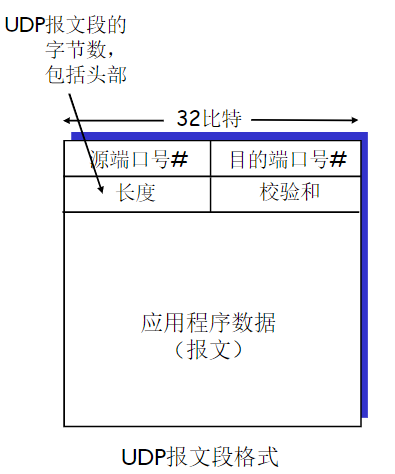

1. 长度字段指示了在UDP报文段中的字节数(首部加数据)，接收方使用检验和来检查在该报文段中是否出现了差错。

UDP校验和
1. 检测在被传输报文段中的差错(如比特反转)，即确定bit是否发生改变
2. 发送方：
   1. 将报文段的内容视为16bit的整数
   2. 校验和：报文段的加法和(1的补运算)
   3. 发送方将校验和放在UDP的校验和字段
3. 接收方：
   1. 计算接收到的报文段的校验和
   2. 检查计算出的校验和于校验和字段的内容是否相等
      1. 不相等--检测到差错
      2. 相等--没有检测到差错，但也许还是有差错：残存错误
4. 当数字相加时，在最高位的进位要回卷再加到结果上(+1)。
5. 目标端：校验范围+校验和=1111111111111111通过校验，否则没有通过校验

差错检测
1. 原因：不能保证源和目的之间的所有链路都提供差错检测，如果端到端数据传输服务要提供差错检测，DUP就必须在端到端的基础上再运输层提供差错检测
2. 端到端原则(end-end principle)：因为某些功能(如差错检测)必须基于端到端实现
3. UDP的差错检测只是向应用程序发出警告但不会修复。

**可靠数据传输原理**

可靠数据传输(rdt)的原理
1. rdt在应用层、传输层和数据链路层都很重要
2. 信道的不可靠特点决定了可靠数据传输协议(rdt)的复杂性

可靠数据传输的框架
1. 为上层实体提供的服务抽象：数据可以通过一条可靠的信道进行传输
2. 可靠数据传输协议(reliable data transfer protocol)实现服务抽象
3. rdt协议的下层协议可能是不可靠的
4. 本章只考虑单项数据传输(undirectional data transfer)的情况

可靠数据传输：问题描述
1. rdt_send():被上层(如应用层)调用，以将数据交付给下方的发送实体
2. deliver_data():被rdt调用，数据交付给上层
3. udt_send():被rdt调用，用以将分组放到不可靠的信道上传输到接收方
4. udt_rcv():当分组通过信道到达接收方时被调用

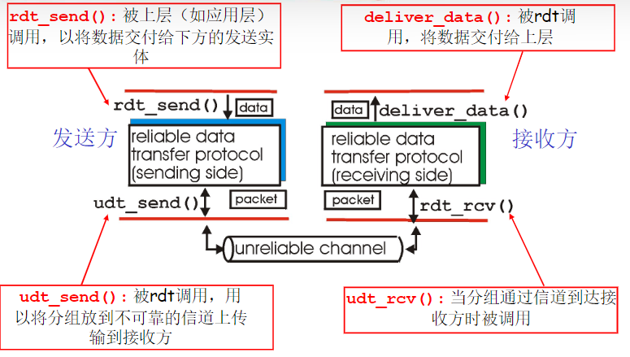

rdt1.0:经完全可靠信道的可靠数据传输
1. 下层的信道是完全可靠的
   1. 没有比特出错
   2. 没有分组丢失
2. 发送方和接收方的FSM
   1. 发送方将数据发送到下层信道
   2. 接收方从下层信道接收数据
3. 有了完全可靠的信道，接收端就不需要提供任何反馈信息给发送方

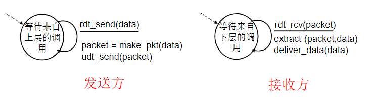

rdt2.0：经具有比特差错信道的可靠数据传输
1. 下层信道可能会出错：将分组中的比特翻转
   1. 用校验和来检测比特差错
2. 问题：怎样从差错中恢复：
   1. 确认(ACK):接收方显式地告诉发送方分组已被正确接收
   2. 否定确认(NCK):接受方显式地告诉发送方分组发生了差错
      1. 发送方收到NAK后，发送方重传分组
3. rdt2.0中的新机制：采用差错控制编码进行差错检测
   1. 发送方差错控制编码、缓存
   2. 接收方使用编码检错
   3. 接收方的反馈：控制报文(ACK、NAK)：接收方->发送方
   4. 发送方收到反馈相应的动作

FSM描述
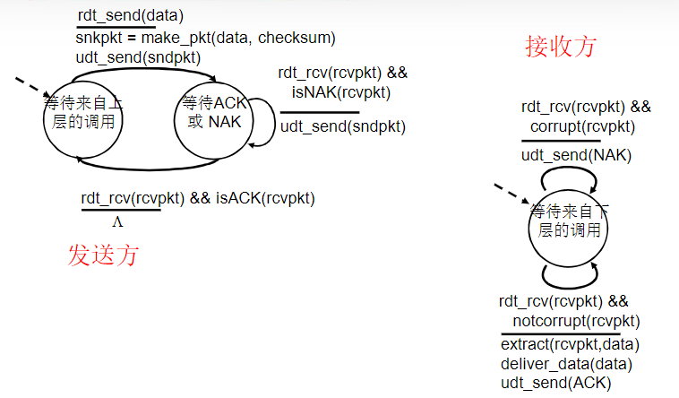

rdt2.0的致命缺陷
1. 如果ACK/NAK出错
   1. 发送方不知道接收方的情况
2. 引入新的机制：序号
3. 处理重复：
   1. 发送方在每个分组中加入序号
   2. 如果ACK/NAK出错，发送方重传当前分组
   3. 接收方丢弃(不发给上层)重复分组
4. 停等协议(stop-and-wait protocol)：发送方发送一个分组然后等待接收方的应答

rdt2.1:发送方处理出错的ACK/NAK
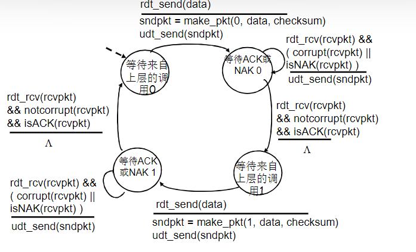

接收方处理出错的ACK/NAK
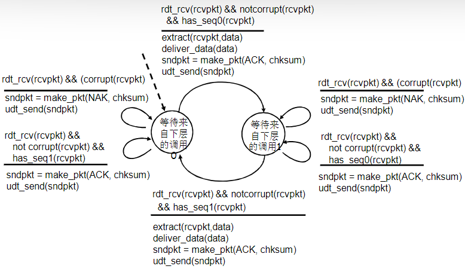

rdt2.1
1. 发送方
   1. 在分组中(数据分组)加入序列号(sequence number)
   2. 两个序列号(0,1)就够
      1. 一次只发送一个未经确认的分组
   3. 必须检测ACK/NAK是否出错(需要EDC)
   4. 状态数变成了两倍
      1. 必须记住当前分组序列是0还是1
2. 接收方
   1. 必须检测接收到的分组是否是重复的
      1. 状态会只是希望接受党的分组序号是0还是1
3. 接收方并不知道发送方是否正确收到了其ACK/NAK

接收方不知道它最后发送的ACK/NAK是否被正确地被收到
1. 发送方没有给确认
2. 接收方发送ACK，接收方收到是老分组，则ACK错误，是下一个分组则ACK正确

kendingqueren(positive acknowledgment)与否定确认(negative acknowledgment)
基于重传机制的可靠数据传输协议称为自动重传请求(Automatic Repeat reQuest ARQ)协议
三种协议功能来处理存在比特差错的情况
1. 差错检测：使接收方检测到何时出现了比特差错，比特汇集在检验和字段中
2. 接收方反馈：ACK 1/NAK 0
3. 重传

rdt2.2:无NAK的协议
1. 功能同rdt2.1,但只使用ACK
2. 接收方对最后正确接受的分组发ACK，以替代NAK：接收方必须显式地包含被正确接收分组的序号
3. 当收到重复的ACK时，发送方与收到NAK擦去相同的动作：重传当前分组
4. 为后面的一次发送给多个数据单位做一个准备
   1. 一次能够发送多个
   2. 使用前一个数据单位的ACK，代替本数据单位的NAK
   3. 确认信息减少一半，协议处理简单

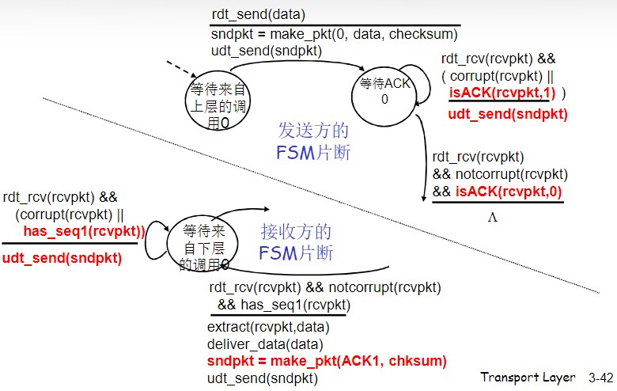

rdt3.0：具有比特差错和分组丢失的信道
1. 新的假设：下层信道可能会丢失分组(数据或ACK)
   1. 会死锁
   2. 机制还不够处理这种状况：检验和、序列号、ACK、重传
2. 方法：发送方等待ACK一段合理的时间
   1. 发送端超时重传：如果到时没有收到ACK->重传
   2. 问题：如果分组(或ACK)只是被延迟了1：
      1. 重传将会导致数据重复，但利用序列号已经可以处理这个问题
      2. 接收方必须指明被正确接收的序列号
3. 需要一个倒计数定时器(countdown timer)

发送方需要做到：
1. 每次发送一个分组(包括第一次分组和重传分组)时，便启动一个定时器
2. 响应定时器中断(采取适当的动作)
3. 终止定时器

rdt3.0 发送方
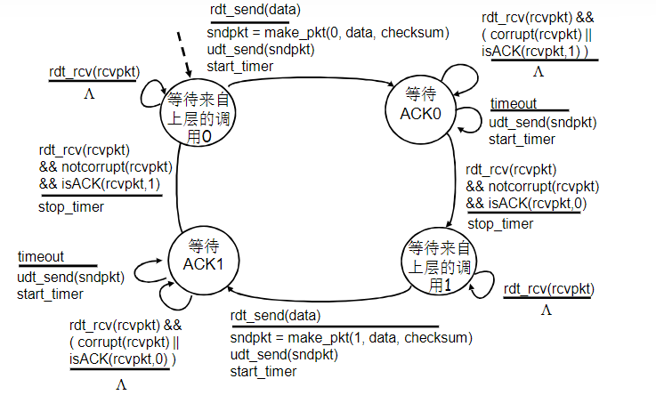

1. 过早超时(延迟的ACK)也能够正常工作，但是效率较低，一半的分组和确认是重复的
2. 设置一个合理的超时时间非常重要

rdt3.0的性能
1. rdt3.0可以工作，但是在链路容量比较大的情况下，性能很差
   1. 链路容量比较大，一次发一个PDU的不能够充分利用链路的传输能力
   2. 忙于发送的时间比例太高，网络协议(停等协议)限制了物理资源的利用

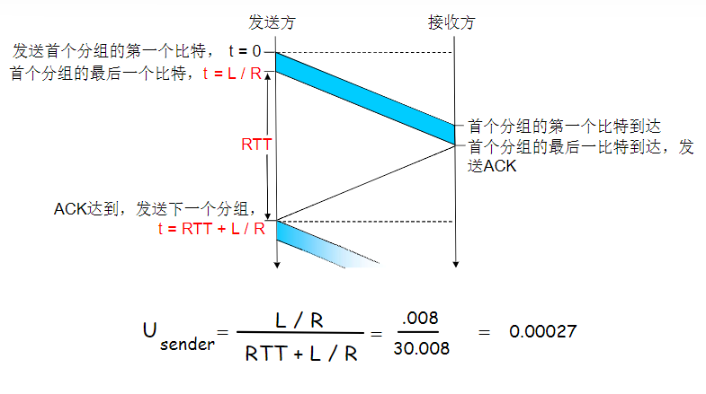

流水线：提高链路利用率
1. 流水线(pipelining):允许发送方在未得到对方确认的情况下一次发送多个分组
   1. 必须增加序号的范围：用多个bit表示分组的序号
   2. 在发送方/接收方要有缓冲区
      1. 发送方缓冲：未得到确认，可能需要重传
      2. 接收方缓存：上层用户取用数据的速率≠接收到的数据速率；接收到的数据可能乱序，排序交付(可靠)
2. 两种通用的流水线协议：回退N步(Go-Back-N,GBN)和选择重传(Selective Repeat,SR)

通用：滑动窗口(slide window)协议
1. 发送缓冲区
   1. 形式：内存中的一个区域，落入缓冲区的分组可以发送
   2. 功能：用于存放已发送，但是没有得到确认的分组
   3. 必要性:需要重发时可用
2. 发送缓冲区的大小：一次最多可以发送多少个未经确认的分组
   1. 停等协议=1
   2. 流水线协议>1
3. 发送缓冲区中的分组
   1. 未发送的：落入发送缓冲区的分组，可以连续发送出去
   2. 已经发送出去的、等待对方确认的分组：发送缓冲区的分组只有得到确认才能删除
4. 窗口滑动过程-相对表示方法
   1. 采用相对移动方式表示，分组不懂
   2. 可缓冲范围移动，代表一段可以发送的权利
   3. 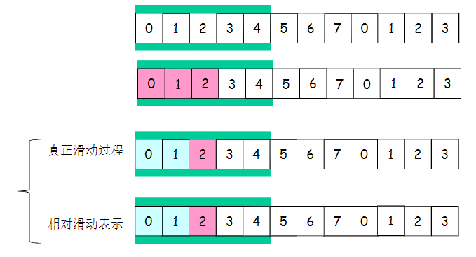
5. 滑动窗口协议
   1. 发送窗口：发送缓冲区内容的一个范围
      1. 那些已发送但是未经确认分组的序号构成的空间
   2. 发送窗口的最大值<=发送缓冲区的值
   3. 一开始：没有发送任何一个分组
      1. 后沿=前沿
      2. 之前窗口尺寸=0
   4. 每发送一个分组，前沿前移一个单位
   5. 不能够超过发送缓冲区
   6. 发送窗口后沿移动
      1. 条件：收到老分组的确认
      2. 结果：发送缓冲区罩住新的分组，来了分组可以发送
      3. 不能超过前沿
6. 异常情况下GBN的2窗口互动
   1. 发送窗口
      1. 新分组落入发送缓冲区范围，发送->前沿滑动
      2. 超时重发机制让发送端将发送窗口中的所有分组发送出去
      3. 来了老分组的重复确认->后沿不向前滑动->新的分组无法落入发送缓冲区的范围
   2. 接收窗口
      1. 收到乱序分组，没有落入到接收窗口范围内，抛弃
      2. (重复)发送老分组的确认，累计确认
7. 异常情况下的SR2两窗口互动
   1. 接收窗口
      1. 收到乱序分组，落入到接收窗口范围内，接收
      2. 发送该分组的确认，单独确认

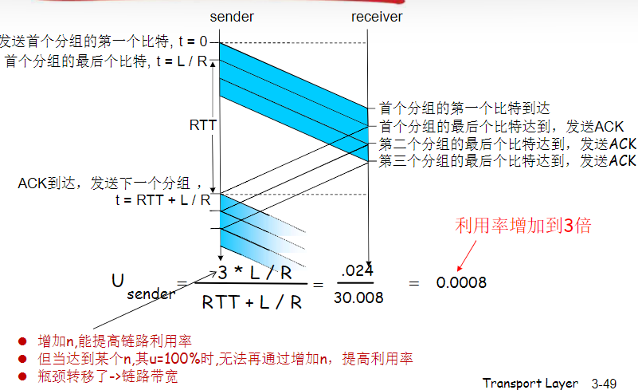

GBN协议和SR协议的异同
1. 相同之处
   1. 发送窗口>1
   2. 一次能够发送多个未经确认的分组
2. 不同
   1. GBN:接收窗口尺寸=1
      1. 接收端：只能顺序接受
      2. 发送端：一旦一个分组没有发成功都要返回失败的那个再发送
   2. SR:接收窗口尺寸>1
      1. 接收：可以乱序接受
      2. 发送：无需重发，选择性发送失败的那个

流水线协议：总结
1. GBN:
   1. 发送端最多在流水线中有N个未确认的分组
   2. 接收端只是发送累积性确认：cumulative ACK
      1. 如果接收端发现gap，不确认信道来的分组
   3. 发送端拥有对最老的未确认分组的定时器
      1. 只需设置一个定时器
      2. 当定时器导师是，重传所有未确认分组
2. SR:
   1. 同上
   2. 单独确认，非累计确认：individual ACK
   3. 为每个未确认的分组保持一个定时器

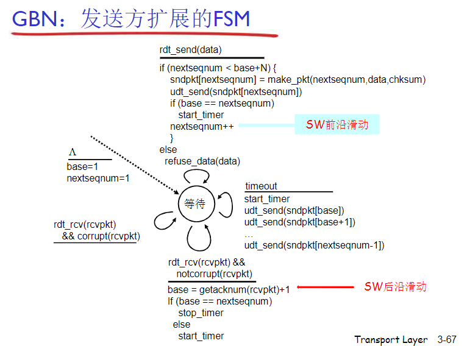

对比GBN和SR
1. 优点：
   1. GBN：简单，所需资源少(接收方一个缓存单元)
   2. SR:出错时，重传一个代价小
2. 缺点：
   1. GBN:一旦出错，回退N步代价大
   2. SR：复杂，所需资源多(多个缓存单元)
3. 适用场景
   1. GBN：出错率低时
   2. SR：链路容量大(延迟大、带宽大)
4. 窗口最大尺寸:
   1. GBN:2^n-1
   2. SR:2^(n-1)

**面向连接的传输TCP**

概述：
1. 点对点，可靠、有序
2. 管道话：TCP拥塞控制和流量控制设置窗口大小
3. 全双工
4. 面向连接
5. 流量控制

TCP报文段结构
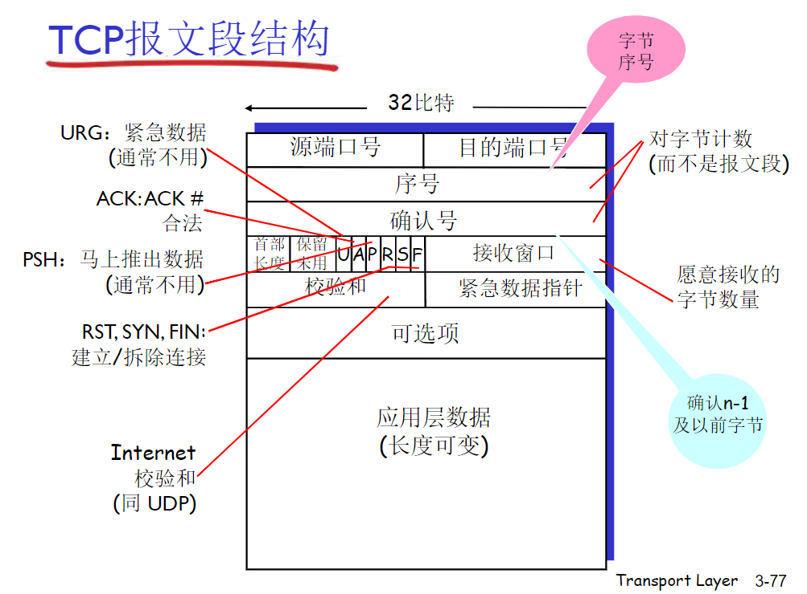

1. 序号：报文段首字节的在字节流的编号
2. 确认号：期望从零乙方收到的下一个字节的序号，累计确认

TCP往返延时(RTT)和超时
1. 预估RTT
   1. SampleRTT：
      1. EstimatedRTT=(1-α)*EstimatedRTT+α*SampleRTT
         1. 指数加权移动平均
         2. 过去样本影响指数衰减
         3. 推荐α=0.125
      2. DevRTT=(1-β)*DevRTT+β*|SampleRTT-EstimatedRTT|
         1. 推荐：β=0.25
         2. TimeoutInterval=EstimatedRTT+4*DevRTT

快速重传:如果发送方收到同一数据的3个冗余ACK，重传最小序号的段

流量控制：不至于让接收方的缓冲区溢出
1. 接受方向发送方的TCP段头部的rwnd字段"通告"其空闲buffer大小
2. 发送方限制未确认<=接收方发送过来的rwnd值

TCP三次握手：
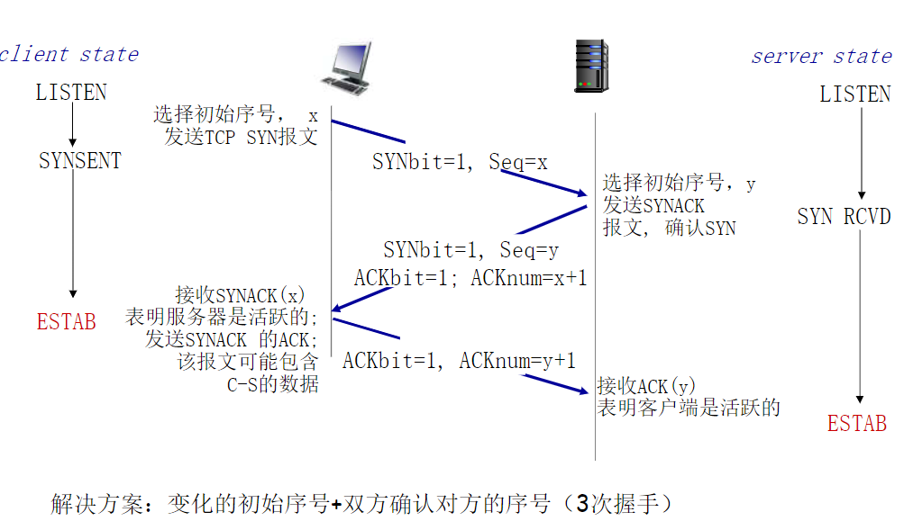

TCP关闭连接：
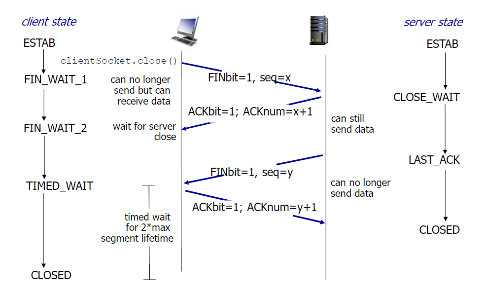

**拥塞控制原理**

拥塞控制方法
1. 端到端拥塞控制(重点)
2. 网络辅助拥塞控制

**TCP拥塞控制**

拥塞控制策略：
1. 慢启动：初始速率很慢，加速时指数级
2. AIMD:线性增、乘性减：丢失事件后进入慢启动阶段，增每次只加1MSS
3. 超时事件后的保守策略：收到重复ACK时进入AIMD，超时事件发生时进入慢启动

总结
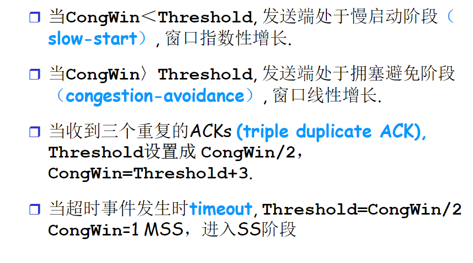