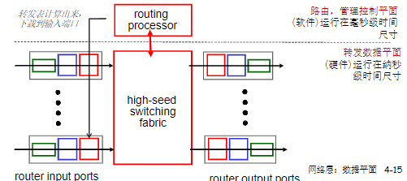
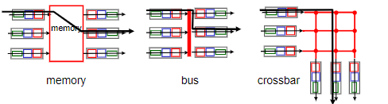
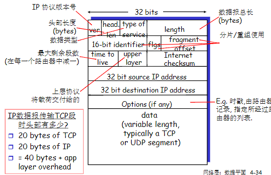
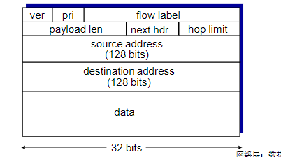

#### 网络层：数据平面

**网络层概述**

网络层服务
1. 在发送主机和接受主机对之间传送段(segment)
2. 在发送端将段封装到数据报中
3. 在接收端，将段上交给传输层实体
4. 网络层协议存在于每一个主机和路由器
5. 路由器检查每一个经过它的IP数据报的头部

网络层的关键功能
1. 转发(forwarding)：将分组从路由器的输入接口转发到合适的输出接口
2. 路由(routing)：使用路由算法来决定分组从发送主机到目标主机的路径
   1. 路由选择算法
   2. 路由选择协议

网络层：数据平面、控制平面
1. 数据平面
   1. 本地，每个路由器功能
   2. 决定从路由器输入端口到达的分组如何转发到输出端口
   3. 主要作用：路由器从其输入链路想起输出链路转发数据报
   4. 转发功能：
      1. 传统方式：基于目标地址+转发表
      2. SDN方式：基于多个字段+流表
2. 控制平面
   1. 网络范围内的逻辑
   2. 决定数据包如何在路由器之间路由，决定数据报从源到目标主机之间的端到端路径
   3. 主要作用：协调本地的每路由器转发动作，使得数据报沿着源和目的地主机之间的路由器路径最终进行端到端传送
   4. 两个控制平面方法：
      1. 传统的路由算法：在路由器中被实现
      2. software-defined networking(SDN):在远程的服务器中实现

传统方式：每-路由器(per-router)控制平面
1. 在每一个路由器中的单独路由器算法元件，在控制平面进行交互
2. 控制平面：路由算法决定端到端路径
3. 数据平面：IP协议根据转发表决定了IP数据报在此路由器上的局部转发

SDN方式：逻辑集中的控制平面：一个不同的(通常是远程的)控制器与本地控制代理(CAs)交互。

网络服务模型
1. 对单个数据报的服务：
   1. 可靠传送
   2. 延迟保证
2. 对于数据报流的服务：
   1. 保序数据报传送
   2. 保证流的最小带宽
   3. 分组之间的延迟差
3. 可能提供的服务
   1. 确保交付
   2. 确保具有时延上界的确保交付
   3. 有序分组交付
   4. 确保最小带宽
   5. 安全性
4. Internet网络层采用尽力而为服务(best-effort service)，不包含以上所有服务

网络层和传输层连接服务区别：
1. 网络层：两个主机之间，涉及到路径上的一些路由器
2. 传输层：两个进程之间，很可能只体现在端系统上(TCP连接)

转发表(forwarding table):路由器检查到达分组首部的一个或多个字段值，进而使用这些首部值在其转发表中索引，通过这种方法来转发分组。

**路由器工作原理**

路由器结构概况
1. 路由：运行路由选择算法/协议(RIP、OSPF、BGP)生成路由表
2. 转发：从输入到输出链路交换数据报-根据路由表进行分组的转发

输入端口(input port):从左到右
1. 物理层：接收
2. 数据链路层：链路层协议动作、解封装
3. 分布式交换：
   1. 根据数据报头部的信息如：目的地址，在输入端口内存中的转发表中查找合适的输入端口(匹配+行动)
   2. 基于目标的转发：仅仅依赖于IP数据报的目标IP地址
   3. 通用转发：基于头部字段的任意集合进行转发
4. 最长前缀匹配前缀(longest prefix matching)：当给定目标地址查找转发表时，采用最长地址前缀匹配的目标地址表项
5. 输入端口缓存：
   1. 当交换机构的速率小于输入端口的汇聚速率时->在输入端口可能要排队
   2. 排队延迟以及输入缓存溢出造成损失
   3. Head-of-Line(HOL) blocking:排在队头的数据报阻止了队列中其他数据报向前移动

交换结构
1. 将分组从输入缓冲区传输到合适的输出端口
2. 交换速率：分组可以按照该速率从输入传输到输出
3. 三种典型的交换机构：内存、总线、纵横式

1. 通过内存交换
   1. 在CPU直接控制下的交换，采用传统的计算机
   2. 分组被拷贝到系统内存，CPU从分组的头部提取出目标地址，查找转发表，找到对应的输出端口，拷贝到输出端口
   3. 转发速率被内存的带宽限制(数据报通过BUS两遍)
   4. 一次只能转发一个分组
2. 通过总线交换
   1. 数据报通过共享总线，从输入端口转发到输出端口
   2. 总线竞争：减缓速度受限于总线带宽
   3. 1次处理一个分组
3. 通过互联网络的交换
   1. 同时并发转发多个分组，克服总线带宽限制
   2. 非阻塞式(non-blocking)：只要没有其他分组当前转发到该输出端口，转发到输出端口的分组将不会被到达输出端口的分组阻塞。
   3. 如果来自两个不同输入端口的两个分组其目的地为相同的输出端口，则一个分组必须在输入端等待。

输出端口
1. 当数据包从交换机构的到达速度比传输速率快就需要输出端口缓存
2. 由调度规则选择排队的数据报进行传输
3. 排队带来延迟，当输出端口缓存溢出则丢弃数据报，则出现丢包(packet loss)
4. 需要多少缓存：当有大量TCP流(N条)时：缓存大小=RTT*C/(N^(1/2)),C:链路的容量

调度机制
1. 调度：选择下一个要通过链路传输的分组
2. FIFO scheduling：按照分组带来的次序发送
3. 丢弃策略：
   1. 弃尾(tail drop):丢弃刚到达的分组,有关策略有主动队列管理(Active Queue Ment，AQM)算法，随机早期检测(Random Early Detection,RED)算法
   2. 优先权排队(priority queueing)：分为高优先权队列和低优先权队列，根据优先权丢失/移除分组
   3. 随机(Random)
4. 优先权排队策略：
   1. 发送最高优先权的分组
   2. 分成高优先级队列和低优先级堆叠：先传高优先级队列中的分组，除非没有
   3. 队列优先权中的分组传输次序：FIFO
5. 非抢占式优先权排队(non-preemptive priority queuing):一旦开始传输就不能被打断
6. 循环排队规则(round robin queuing discipline):保持工作排队(work-serving queuing)，不允许链路空闲
7. 加权公平排队(Weighted Fair Queuing,WFQ)
   1. 一般化的Round Robin
   2. 在一段时间内，每个队列得到的服务时间是：(Wi/(∑Wj))*t,和权重成正比
   3. 每个类在每一个循环中获得不同权重的服务量

**网际协议：IPv4、寻址、IPv6及其他**

IPv4数据报格式
1. 版本：4bit规定数据报的IP协议版本，有助于路由器如何解释IP数据报的剩余部分
2. 首部长度：4bit确定IP数据报中的载荷
3. 服务类型(TOS):时不同类型的IP数据报能区别开来
4. 数据报长度：IP数据报的总长度(首部+数据)
5. 标识、标志、片偏移：与IP分片有关，IPv6不允许在路由器上对分组分片
6. 寿命(Time-To-Live,TTL):TTL减为0则必须被丢弃
7. 协议：指示IP数据报的数据部分应交给哪个特定的运输层协议，6->TCP,17->UDP.
8. 首部检验和：帮助路由器检测收到的IP数据报中的比特错误，2个字节为一个数，用反码算术对这些数求和
9. 源和目的IP地址
10. 选项：允许IP首部被扩展
11. 数据(有效载荷)

IP分片和重组(Fragmentation & Reassembly)
1. 网络链路有MTU(最大传输单元)-链路层帧所携带的最大数据长度
   1. 不同的链路类型-不同的MTU
2. 大的IP数据报在网络上被分片(fregmented)
   1. 相同的ID
   2. 不同的偏移量
   3. 最后一个分片标记为0
3. “重组”只在最终的目标主机进行
4. IP头部的信息被用于标识，排序相关分片

IPv4编址
1. IP要求每台主机和路由器接口拥有自己的IP地址
2. 子网(Subnets):
   1. IP地址：
      1. 子网部分(高位bits)
      2. 主机部分(低位bits)
   2. 什么是子网：
      1. 一个子网内的节点它们的IP地址的高位部分相同，这些节点构成的网络的一部分叫做子网
      2. 无需路由器介入，子网内各主机可以在物理上相互直接到达
   3. 方法：要判断一个子网，将每个接口从主机或者路由器上分开，构成一个网络的孤岛，每个孤岛都是一个subnet
3. 特殊IP地址：
   1. 子网部分：全为0->本网络
   2. 主机部分：全为0->本主机
   3. 主机部分：全为1->广播地址，这个网络的所有地址
4. 内网专用IP地址
   1. 专用地址：地址空间的一部分供专用地址使用
   2. 永远不会被当做共用地址来分配
   3. 路由器不对目标地址是专用地址的分组进行转发
5. 无类别域间路由选择CIDR(Classless InterDomain Routing)
   1. 子网部分可以在任意的位置
   2. 地址格式：a.b.c.d/x,其中x是地址中子网号的长度，即前缀(prefix)
6. 子网掩码(subnet mask):
   1. 32bits，0 or 1 in each bit
      1. 1：bit位置标识子网部分
      2. 0：bit位置表示主机部分
7. DHCP(Dynamic Host Configuration Protocol)：
   1. 从服务器中动态获得一个IP地址，也称即插即用协议(plug-and-play protocol)，或零配置(zeroconf)协议。
   2. 可以个更新对主机再用IP地址的租用期-租期快到了
   3. 重新启动时，允许重新使用以前用过的IP地址
   4. 支持移动用户加入到该网络(短期在网)
   5. DHCP返回：IP地址、第一条路由器的IP地址(默认网关)、DNS服务器的IP地址、子网掩码(指示地址部分的网络号和主机号)
   6. DHCP发现->DHCP提供->DHCP请求->DHCP ACK
8. ICANN:Internet Corporation for Assigned Names and Numbers
   1. ISP获得一个地址块
   2. 分配地址
   3. 管理DNS
   4. 分配域名、解决冲突
9. NAT(Network Address Translation):
   1.  不需要从ISP分配一块地址，可用一个IP地址用于所有的设备
   2.  可以在局域网改变设备地址的情况下无需通知外界
   3.  可以改变ISP而不需要改变内部的设备地址
   4.  内部设备地址对外不可见
   5.  实现NAT路由器需要三个条件：
       1.  外出数据包：替换源地址和端口号为NAT IP地址和新端口号
       2.  记住每个转换替换对
       3.  进入数据包：替换目标IP地址和端口号

IPv6头部(Cont)
1. Priority:标示流中数据报的优先级
2. Flow Label：标示数据报在一个“flow”
3. Next Header：标示上层协议

和IPv4的其他变化
1. Checksum:被移除掉，降低在每一段中的处理速度
2. Options:允许，但是在头部之外，被“Next Header”字段标示
3. ICMPv6:ICMP新版本
   1. 附加了报文类型
   2. 多播组管理功能

IPv4到IPv6的平移
1. 隧道(tunnel):两台IPv6路由器之间的中间IPv4路由器的集合；在IPv4路由器之间传输的IPv4数据报中携带IPv6数据报

**通用转发和SDN**

SDN的主要思路
1. 网络设备数据平面和控制平面分离
2. 数据平面-分组交换机
   1. 将路由器、交换机和目前大多数网络设备的功能进一步抽象成：按照流表(flow table)进行PDU(帧、分组)的动作
   2. 统一化设备功能：SDN交换机(分组交换机)，执行控制逻辑
3. 控制平面-控制器+网络应用
   1. 分离、集中
   2. 计算和下发控制逻辑

SDN控制平面和数据平面分离的优势
1. 水平集成平面的开放实现
2. 集中式实现控制逻辑，网络管理容易
3. 允许可编程分组交换机

SDN特点
1. 通用“flow-based”基于流的匹配+行动
2. 控制平面和数据平面的分离
3. 控制平面功能在数据交换设备之外实现
4. 可编程控制应用--在控制器之上以网络应用形式实现各种网络功能

流表
1. 首部字段值的集合，入分组将与之匹配
2. 计数器集合：包括已经与该表项匹配的分组输俩个，以及自从该表项上次更新以来的时间
3. 当分组匹配流表项时所采取的动作集合

OpenFlow数据平面抽象
1. 流：由分组(帧)头部字段所定义
2. 通用转发：简单的分组处理规则
   1. 模式Pattern：将分组头部字段和流表进行匹配
   2. 动作：对于匹配上的分组，可以是丢弃、转发、修改、将匹配的分组发给控制器
   3. 优先权Priority：几个模式匹配了，优先采用哪个，消除歧义
   4. 计数器Counters