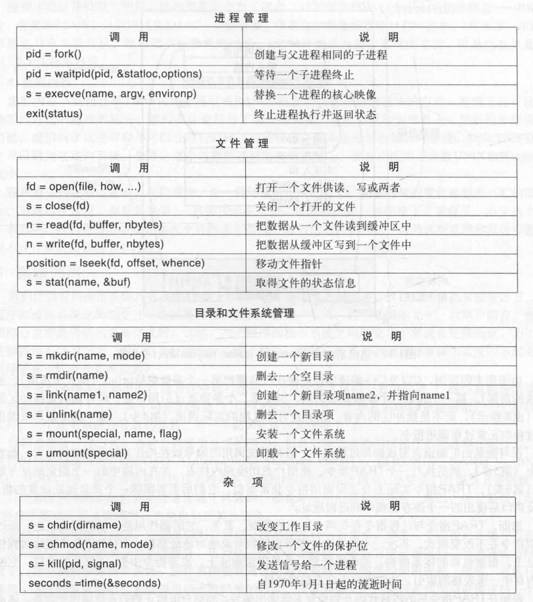

### 引论（introduction）

**shell**:用户基于文本与之交互的程序。

**图形用户界面（Graphical User Interface，GUI）**:基于图标的交互程序。

#### 什么是操作系统

**操作系统的主要任务**

记录哪个程序在使用什么资源，对资源请求进行分配，评估使用代价，并且为不同的程序和用户调解互相冲突的资源请求。

**资源管理使用多路复用（共享）资源的方式**：

1. 在时间上复用 :先后顺序分别获得资源的使用，排队使用
2. 在空间上复用 :每个客户得到资源的一部分

**操作系统的历史**

1. 第一代（1945~1955）：真空管和穿孔卡片（Vacuum Tubes）：进行简单的数学运算，如制作正弦、余弦、对数表或计算炮弹弹道等。
2. 第二代（1955~1965）：晶体管和批处理系统（Transistors and Batch Systems）：大型机（mainframe）：程序写到纸上（用FORTRAN语言或汇编语言），穿孔成卡片并进行输出，主要用于科学与工程计算，如解偏微分方程。
3. 第三代（1965~1980）：集成电路和多道程序设计（ICs and Multiprogramming）：特性其一：多道程序设计：将内存分几个部分，每一部分存放不同的作业；特性其二：同时外部设备联机操作（Simultaneous Peripheral Operation On Line，SPOOLing）,主要用于大型科学计算和繁忙的商务数据处理，本质上是批处理系统，后来催生出==分时系统（多道程序的一个变体，每个用都有一个联机终端）==（timesharing），第一个分时系统是兼容分时系统（Compatible Time Sharing System，CTSS），此时小型机开始崛起。
4. 第四代（1980至今）：个人计算机（Personal Computers）
5. 第五代（1990至今）：移动计算机（Mobile Computers）

#### 计算机硬件简介

**处理器（Processors）**

从内存取出指令并执行。

包含以下专用寄存器：
1. 程序计数器（program counter）：保存将要取出的下一条指令的内存地址。
2. 堆栈指针（stack pointer）：指向内存中当前栈的顶端，包含每个执行过程的栈帧。
3. 程序状态字（Program Status Word，PSW）：包含了条件码位、CPU优先级、模式（用户态或内核态）、以及其他控制位。

流水线（pipeline）：同时取出多条指令的机制。

超标量CPU：流水线进化版，有多个执行单元，且程序的指令经常不按顺序执行。多数CPU有两种模式，内核态和用户态。用户程序通过系统调用(system call)从操作系统中获得服务。TRAP指令把用户态切换成内核态，并启用操作系统。

**存储器**：

访问速度：寄存器（register）>高速缓存（cache）>主存（main memory）>磁盘（disk）

主存被分割成高速缓存行（cache line）

如果高速缓存行在高速缓存中，称为高速缓存命中。

Cache：
1. 一级缓存（L1缓存）：在CPU中，将已解码的指令调入CPU的执行引擎，通常为16KB。
2. 二级缓存（L2缓存）：存放近来使用过的若干兆字节的内存字。一级缓存没有延时，二级缓存会延时1到2个时钟周期。

主存：通常为随机访问存储器（Random Access Memory，RAM）。

只读存储器（Read Only Memory,ROM）:速度快且便宜。

EEPROM(Electrically Erasable PROM,电可擦除可编程ROM)(flash memory):非易失性，可以擦除和重写。

CMOS存储器：保存当前时间和日期，易失性。

**磁盘**

磁道（track）：磁头可以读取的一段环形区域。

柱面（cylinder）：所有磁道合并起来。

虚拟内存：将程序放在磁盘上，将主存作为一种缓存。这种机制需要快速地映像内存地址，以便把程序生成地地址转换为有关字节在RAM中的物理地址。由CPU中的存储器管理单元（Memory Management Unit，MMU）完成。

上下文切换（context switch）：在多道程序系统中从一个程序切换到另一个程序。

**I/0设备**

设备驱动程序装入操作系统的途径：
1. 将内核与设备驱动程序重新链接，然后重启动系统。
2. 在一个操作系统文件中设置一个入口，并通知该文件需要一个设备驱动程序，然后重启动系统。在系统启动时，操作系统去找寻所需的设备驱动程序并装载。
3. 操作系统能够在运行时接受新的设备驱动程序并立即将其安装好，无需重启动系统。

实现输入和输出的方式：
1. 用户程序发出一个系统调用，内核将其翻译成一个对应设备驱动程序的过程调用。设备旭东程序启动I/O并在一个连续不断的循环中检查该设备，看是否完成工作。称为忙等待（busy waiting），缺点时占据CPU
2. 设备驱动程序启动设备并且让该设备在操作完成时发生一个中断。设备驱动程序在这个时刻返回。操作完毕时，它发出一个中断通知操作完成。
3. 为I/O使用一种特殊的直接存储器访问（Direct Memory Access，DMA）芯片，它可以控制在内存和某些控制器之间的位流，而无需持续的CPU干预。

**总线**

主要是PCIe（Peripheral Component Interconnect Express）总线

共享总线架构（shared bus architecture）：多个设备使用一些相同的导线传输数据。仲裁器决定哪个设备可以使用总线。2004年以前的大多数总线。

并行总线架构（parallel bus architecture）：通过多条导线发送数据的每一个字。传统PCI总线

串行总线架构（serial bus architecture）：通过一条被称为数据通路的链路传递集合了所有位的一条信息。PCIe使用的架构。

#### 操作系统类型

1. 大型机操作系统（Mainframe OS）
2. 服务器操作系统（Server OS）
3. 多处理器操作系统（Multiprocessor OS）
4. 个人计算机操作系统（Personal Computer OS）
5. 掌上计算机操作系统（Handheld Computer OS）
6. 嵌入式操作系统（Embedded OS）
7. 传感器节点操作系统（Sensor-Node OS）
8. 实时操作系统（Real-Time OS）
9. 智能卡操作系统（Smart Card OS）

#### 操作系统的概念

操作系统的两种功能
1. 为用户程序提供抽象
2. 管理计算机资源

**进程（process）**

本质：正在执行的一个程序，包括地址空间、资源集，资源集通常包括寄存器（含程序计数器和堆栈指针）、打开文件的清单、突出的报警、有关进程清单、以及运行该程序所需要的所有其他信息，是==一个容纳运行一个程序所需要所有信息的容器==。

地址空间（address space）：从某个最小值的存储位置（通常是零）到某个最大值的存储位置的列表。地址空间中存放有可执行程序、程序的数据以及程序的堆栈。

进程表（process table）：一个进程有关的所有信息除了地址空间所包含的内容外其他的存在进程表中。通常为数组或链表结构。

**文件**

管道是一种虚文件，它可连接两个进程。

**保护**

常用指令：

date：创建一个子进程，并运行date程序作为子进程

sort<file1>file2：调用sort程序，从file1总取得输入，输出送到file2.

cat file1 file2 file3|sort>/dev/lp:cat程序将这三个文件合并，其结果送到sort程序并按照字典序排序，sort输出又被重定向到文件/dev/lp中

cat file1 file2 file3|sort>/dev/lp &:不等其结束直接显示出提示符，在后台运行。

#### 系统调用

任何单CPU计算机一次只能执行一条指令。如果一个进程正在用户态运行一个用户程序，并且需要一个系统服务，，比如从一个文件读数据，那么就必须执行一个TRAP指令或系统调用指令，将控制转移到操作系统。操作系统接着通过参数检查找出所需要的调用进程。==只有系统调用可以进入内核，而过程调用不能。==

POSIX常用过程调用：

#### 操作系统结构

1. 单体系统（Monolithic Systems）
2. 层次式系统（Layered Systems）
3. 微内核（Microkernels）
4. 客户端-服务器模式（Client-server Model）
5. 虚拟机（Virtual Machines）
6. 外核（Exokernels）