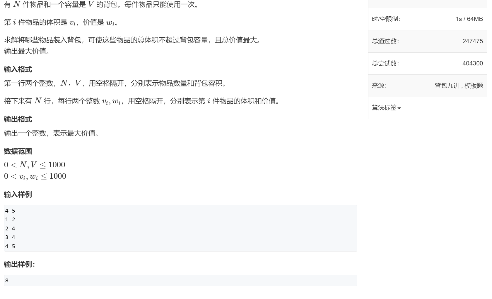
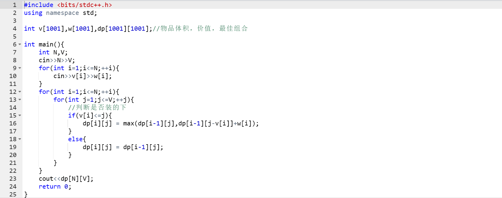
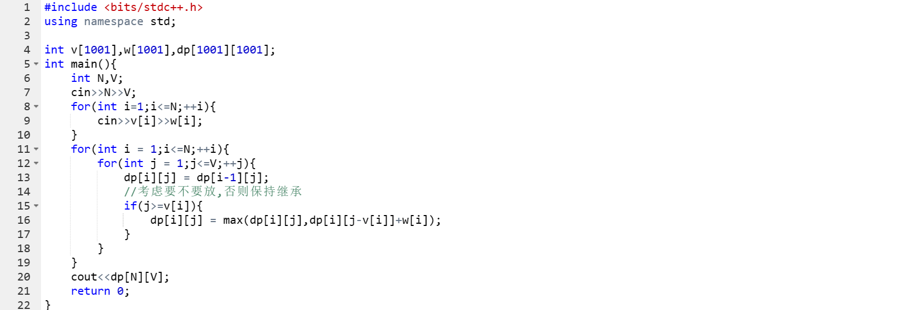
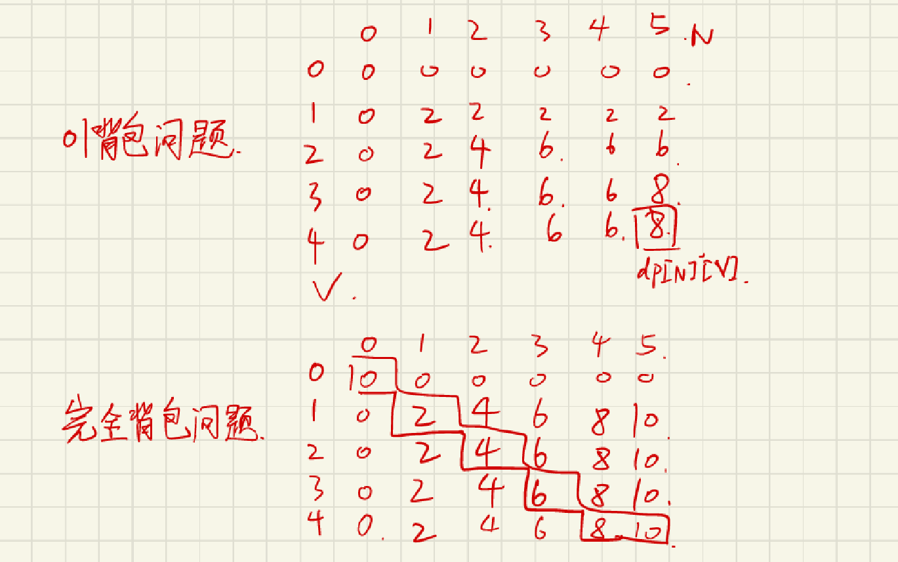

# 背包问题

## 01背包问题

### 解题思路：

背包问题的解法通常考虑两种情况：
1. 如果装不下该物品，则前n个物品的最佳组合和前n-1个物品的最佳组合是一样的；
2. 如果装的下该物品：
   1. 装该物品：在给当前物品预留了空间的情况下，前n-1个物品的最佳组合加上该物品的价值就是总价值
   2. 不装该物品：前n个物品的最佳组合与前n-1个物品的最佳组合一样
   比较这两种情况，取价值更高的那一种情况。

==***tips：无论是记录物品体积和价值还是记录最佳组合都要以1为开始下标，这样才能保证dp[N][V]是我们所预期的答案。***==

背包问题的回溯：
1. 从表的右下方开始，前n个物品的总价值和前n-1个物品的总价值进行比较，若一样则说明该物品没有被装入；若不一样则说明该物品已被装入。
2. 然后减去该物品所需要的空间，根据背包所剩下的空间跳到上一个物品对应的位置，重复第一步，直到总价值回溯到0。

## 完全背包问题

解题思路：
1. 以一个dp二维数组来储存该物品在背包该容量下的最大价值
2. 无论装不装的下该物品，都先继承前n-1个物品的最佳组合
    1. 若装不下该物品，则保持继承状态
    2. 若装的下，则比较前n-1个物品的最佳组合和加上该物品价值后的总价值，取较大者继承。

tips：与01背包问题的题解比较我们可以发现，完全背包问题的双for语句内，前n个物品的最佳组合先继承了前n-1个物品的最佳组合。==***这个改动所造成的两个问题题解最大差别是，01背包问题在考虑是否放该物品时是以前n-1个物品的最佳组合为评判标准，而完全背包问题中前n个物品的最佳组合因为已经继承了前n-1个物品的最佳组合，所以比较大小时是以前n个物品的这一行的值为比较标准。***==

tips:01背包问题和完全背包问题最大的区别在于完全背包问题可以叠加同一个物品，01背包物品每种物品只有一个。

完全背包问题另解（dp滚动一维数组）:

***该解法的一个重要的需要理解的地方在于，每次背包最佳组合改变都是在第n个物品体积的那一列开始改变，之前完全是继承前n-1个物品的最佳组合，所以我们只需要记录改变的那一串阶梯型的数字，再以背包容量为下标就可以找到相应的最佳组合，此解法优化了dp二维数组所占的空间。***

以下是列表解题的思路：

## 多重背包问题

