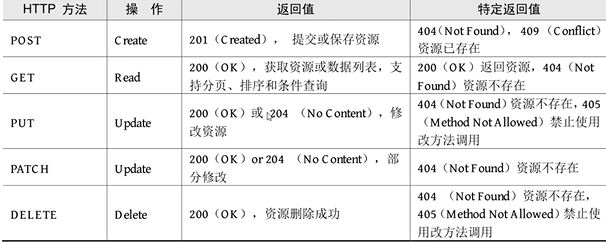
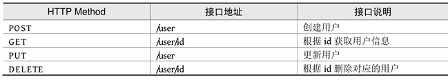
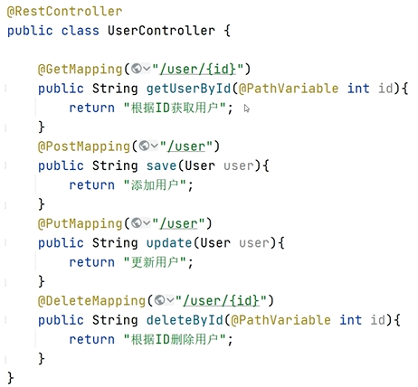
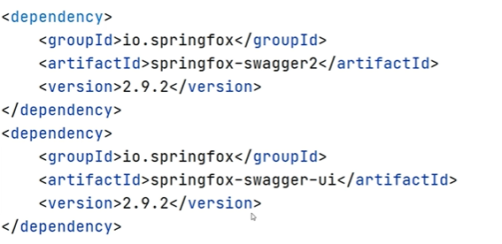
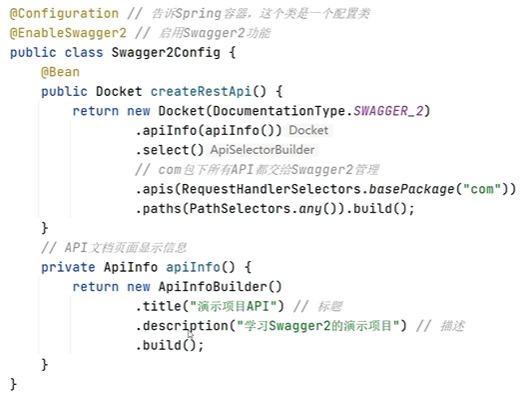

### RESTful的特点


每一个URL代表一种资源。

客户端使用GET、POST、PUT、DELETE四种表示操作方式的动词对服务器资源进行操作；GET用于获取资源、POST用于新建资源（也可以用于更新资源），PUT用于更新资源、DELETE用于删除资源。

通过操作资源的表现形式来实现服务端请求操作。

资源的表现形式是JSON或者HTML。

客户端与服务端之间的交互在请求之间是无状态的，从客户端到服务端的每个请求都包含必需的信息。


### RESTful API


符合RESTful规范的Web API需要具备如下两个关键特性：

1. **安全性**：安全的方法被期望不会产生任何副作用，当我们使用GET操作获取资源时，不会引起资源本身的改变，也不会引起服务器状态的改变。

2. **幂等性**：幂等的方法保证了重复进行一个请求和一次请求的效果相同（并不是指相应总是相同的，而是指服务器上资源的状态从第一次请求后就不再改变了），在数学上幂等性是指N次变换与一次变换相同。


### HTTP Method


一些常用的HTTP方法及其在RESTful风格下的使用：




### HTTP状态码


HTTP状态码就是服务向用户返回的状态码和提示信息，客户端的每一次请求，服务都必须给出回应，回应包括HTTP状态码和数据两部分。

状态码分为以下5个类别：

1xx：信息，通信传输协议级信息
2xx：成功，表示客户端的请求已成功接收
3xx：重定向，表示客户端必须执行一些其他操作才能完成其请求
4xx：客户端错误，此类错误状态码指向客户端
5xx：服务器错误，服务器负责这类错误状态码


### Spring Boot 实现 RESTful API


**@GetMapping** :处理GET请求，获取资源
**@PostMapping** :处理POST请求，新增资源
**@PutMapping** :处理PUT请求，更新资源
**@DeleteMapping** :处理DELETE请求，删除资源
**@PatchMapping** :处理PATCH请求，用于部分更新资源

在RESTful架构中，每个网址代表一种资源，所以URL中建议不要包含动词，只包含名词即可，而且所用名词往往与数据库的表格名对应。


用户管理模块API实例：



代码示例：




### 什么是Swagger


Swagger能够自动生成完善的RESTful API文档，同时并根据后台代码的修改同步更新，同时提供完整的测试界面来调试API。


### 使用Swagger生成Web API文档


在项目中引入spring-swagger2和springfox-swagger-ui依赖。




配置Swagger




**==注意事项==**

Spring Boot 2.6.x后与Swagger有版本冲突问题，需要在applicatio.properties中加入以下配置:

```java
spring.mvc.pathmatch.matching-strategy=ant_path_matcher
```

### 使用 Spring Doc  生成 OpenAPI 3.0 文档


Spring Boot 3.x以上的版本采用Spring Doc生成API文档，先再pom.xml中加入以下依赖：

```java
   <dependency>
      <groupId>org.springdoc</groupId>
      <artifactId>springdoc-openapi-starter-webmvc-ui</artifactId>
      <version>2.5.0</version>
   </dependency>
```

成功导入依赖后，通过访问以下网址访问OpenAPI描述:

```java
http://localhost:8080/v3/api-docs
```


还可以在application.properties中自定义描述路径：

```java
springdoc.api-docs.path=/api-docs
```


之后可以通过以下地址访问API描述：

```java
http://localhost:8080/api-docs
```


### 整合Swagger UI


springboot-openapi中的依赖已经包含Swagger UI，可以从以下地址访问API 文档：
```java
http://localhost:8080/swagger-ui/index.html
```

同样可以自定义描述路径：
```java
springdoc.swagger-ui.path=/swagger-ui-custom.html
```


根据HTTP方法对API路径进行排序：

```java
springdoc.swagger-ui.operationsSorter=method
```