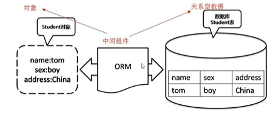

### ORM介绍

ORM(Object Relational Mapping,对象关系映射)是为了解决面向对象与关系数据库存在的互不匹配现象的的一种技术。

ORM通过使用描述对象和数据库之间映射的元数据将程序中的对象自动持久化到关系数据库中。

ORM框架的本质是简化编程中操作数据库的编码

### MyBatis-Plus介绍

MyBatis是一款优秀的数据持久层ORM框架，被广泛地应用于应用系统。

MyBatis能够非常灵活地实现动态SQL，可以使用XML或注解来配置和映射原生信息，能够轻松地将Java地POJO(Plain Ordinary Java Object,普通的Java对象)与数据库中的表和字段进行映射关联。

MyBatis-Plus是一个Mybatis的增强工具，简化了开发。

### 添加依赖

