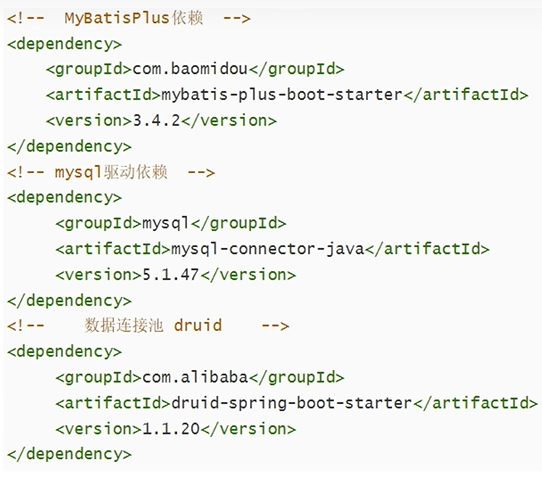
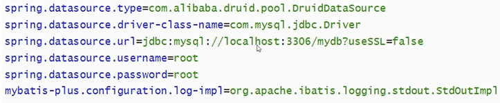
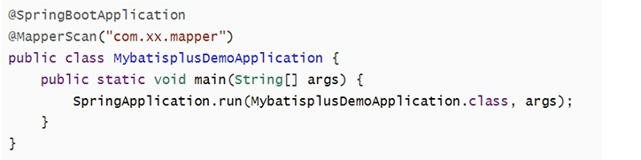

### ORM介绍


ORM(Object Relational Mapping,对象关系映射)是为了解决面向对象与关系数据库存在的互不匹配现象的的一种技术。

ORM通过使用描述对象和数据库之间映射的元数据将程序中的对象自动持久化到关系数据库中。

ORM框架的本质是简化编程中操作数据库的编码


### MyBatis-Plus介绍


MyBatis是一款优秀的数据持久层ORM框架，被广泛地应用于应用系统。

MyBatis能够非常灵活地实现动态SQL，可以使用XML或注解来配置和映射原生信息，能够轻松地将Java地POJO(Plain Ordinary Java Object,普通的Java对象)与数据库中的表和字段进行映射关联。

MyBatis-Plus是一个Mybatis的增强工具，简化了开发。


### 添加依赖





修正版
```java
        <!-- MybatisPlus依赖,注意要更新到3.5.5，并且添加mybatis依赖，即第二个 -->
        <dependency>
            <groupId>com.baomidou</groupId>
            <artifactId>mybatis-plus-boot-starter</artifactId>
            <version>3.5.5</version>
        </dependency>
        <dependency>
            <groupId>org.mybatis</groupId>
            <artifactId>mybatis-spring</artifactId>
            <version>3.0.3</version>
        </dependency>
        <!--lombok依赖-->
        <dependency>
            <groupId>org.projectlombok</groupId>
            <artifactId>lombok</artifactId>
            <scope>provided</scope>
        </dependency>
        <!-- mysql驱动依赖 -->
        <dependency>
            <groupId>mysql</groupId>
            <artifactId>mysql-connector-java</artifactId>
            <version>8.0.33</version>
        </dependency>
```


### 全局配置


配置数据库相关信息




这里添加数据库，"mydb"为数据库名称
```java
spring.datasource.url=jdbc:mysql://localhost:3306/mydb
```


添加@MapperScan注解



启动mapper扫描


### 案例展示

1. 在com.example.mpdemo创建三个package，"entity","controller","mapper".
2. controller添加UserController类,代码如下：
   ```java
    package com.example.mpdemo.controller;

    import com.baomidou.mybatisplus.annotation.TableName;
    import com.example.mpdemo.entity.User;
    import com.example.mpdemo.mapper.UserMapper;
    import org.springframework.beans.factory.annotation.Autowired;
    import org.springframework.web.bind.annotation.GetMapping;
    import org.springframework.web.bind.annotation.PostMapping;
    import org.springframework.web.bind.annotation.RestController;

    import java.util.List;

    @RestController
    public class UserController {

        @Autowired
        private UserMapper userMapper;

        @GetMapping("/users")
        public List query(){
            List<User> list = userMapper.selectList(null);
            System.out.println(list);
            return list;
        }

        @PostMapping("/users")
        public String save(User user){
            int i = userMapper.insert(user);
            if(i>0){
                return "插入成功";
            }
            else{
                return "插入失败";
            }
        }


    }
   ```
3. entity包添加User类，代码如下：
   ```java
   package com.example.mpdemo.entity;

   import com.baomidou.mybatisplus.annotation.IdType;
   import com.baomidou.mybatisplus.annotation.TableId;
   import com.baomidou.mybatisplus.annotation.TableName;

   import java.util.Date;

   //表名和类名不同一定要加TableName，不然映射不上,很重要！！！
   @TableName("users")
   public class User {
       //@TableId(type = IdType.AUTO),用于赋值给user对象,
       //@TableField("nickname")用于表内名和类内名不同的情况
       private int uid;
       private String username;
       private String password;
       private String birthday;

       public int getUid() {
           return uid;
       }

       public void setUid(int uid) {
           this.uid = uid;
       }

       public String getUsername() {
           return username;
       }

       public void setUsername(String username) {
           this.username = username;
       }

       public String getPassword() {
           return password;
       }

       public void setPassword(String password) {
           this.password = password;
       }

       public String getBirthday() {
           return birthday;
       }

       public void setBirthday(String birthday) {
           this.birthday = birthday;
       }

       @Override
       public String toString() {
           return "User{" +
                   "uid=" + uid +
                   ", username='" + username + '\'' +
                   ", password='" + password + '\'' +
                   ", birthday='" + birthday + '\'' +
                   '}';
       }
   }
   ```
4. 在mapper包创建UserMapper接口，代码如下：
   ```java
   package com.example.mpdemo.mapper;

   import com.baomidou.mybatisplus.annotation.TableName;
   import com.baomidou.mybatisplus.core.mapper.BaseMapper;
   import com.example.mpdemo.entity.User;
   import org.apache.ibatis.annotations.Delete;
   import org.apache.ibatis.annotations.Insert;
   import org.apache.ibatis.annotations.Mapper;
   import org.apache.ibatis.annotations.Select;

   import java.util.List;

   // 提供对表的操作接口，接口实现由mybatis自己实现
   @Mapper
   public interface UserMapper extends BaseMapper<User> {
   // 查询所有用户
       /*
       @Select("select * from users")
       public List<User> find();

       @Insert("insert into users values(#{uid},#{username},#{password},#{birthday})")
       public int insert(User user);
       */

   }
   ```
5. 在MpDemoApplication.java文件中添加以下注解
```java
@MapperScan("com.example.mpdemo.mapper")
```
6. 配置数据库省略


### 多表查询


