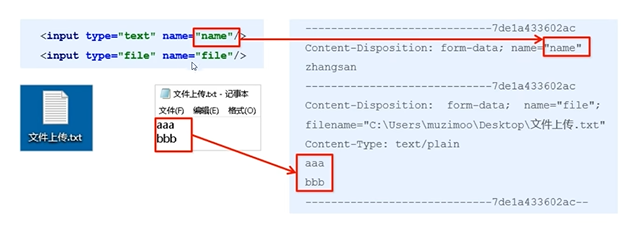
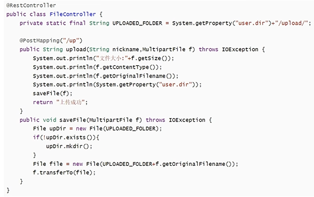
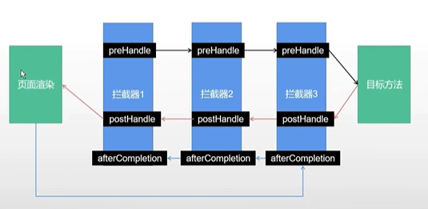
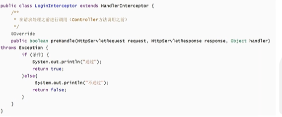
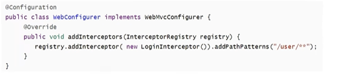

### 静态资源访问


可以自定义静态资源过滤策略
在application.properties中直接定义过滤规则和静态资源位置：

```java
spring.mvc.static-path-pattern=/static/**
spring.web.resources.static-locations=classpath:/static/
```


### 文件上传原理


表单的enctype属性规定在发送到服务器之前应该如何对表单数据进行编码

表单的enctype="application/x-www-form-urlencoded"(默认)时，form表单中的数据格式为：key=value&key=value

当表单的enctype="multipart/form-data"时，会有特殊的传输数据形式




### SpringBoot实现文件上传功能


Spring Boot工程嵌入的tomcat限制了请求的文件大小，每个文件的配置最大为1Mb，单次请求的文件的总数不能大于10Mb。

要更改这个默认值需要在配置文件(如application.properties)中加入两个配置

```java
spring.servlet.multipart.max-file-size=10MB
spring.servlet.multipart.max-request-size=10MB
```


### SpringBoot实现文件上传功能


当表单的enctype="multipart/form-data"时，可以使用MultipartFile获取上传的文件数据，再通过transferTo方法将其写入到磁盘中




当想要访问上传的图片时在application.properties处加以下代码
```java
spring.web.resources.static-locations=/upload/
```


### 拦截器


Spring Boot定义了HandlerInterceptor接口来实现自定义拦截器的功能

HandlerInterceptor接口定义了preHandle、postHandle、afterCompletion三种方法，通过重写这三种方法实现请求前、请求后等操作



#### 拦截器定义



#### 拦截器注册

addPathPatterns方法定义拦截的地址
excludePathPatterns定义排除某些地址不被拦截
添加的一个拦截器没有addPathPattern任何一个url则默认拦截所有请求
如果没有excludePathPatterns任何一个请求，则默认不放过任何一个请求

